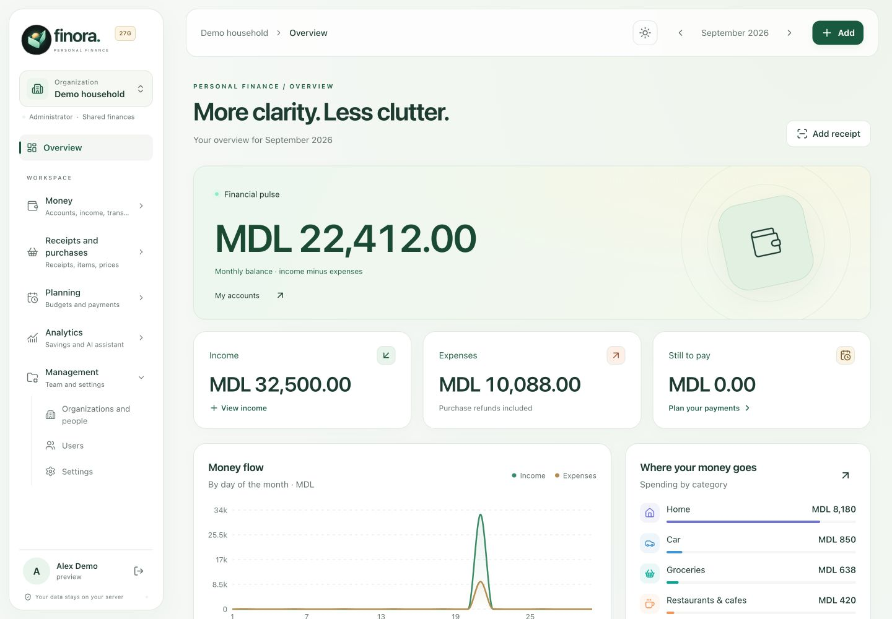
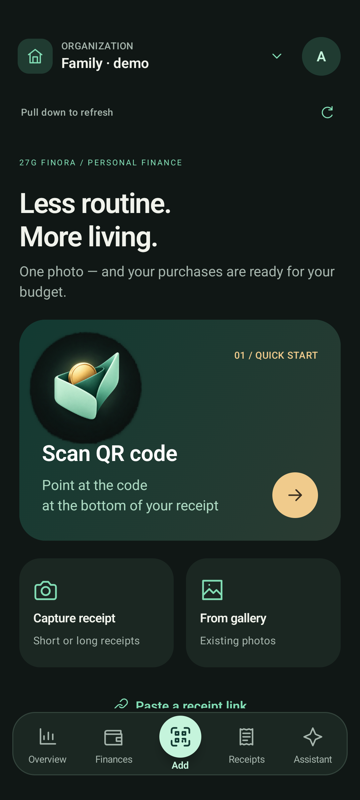
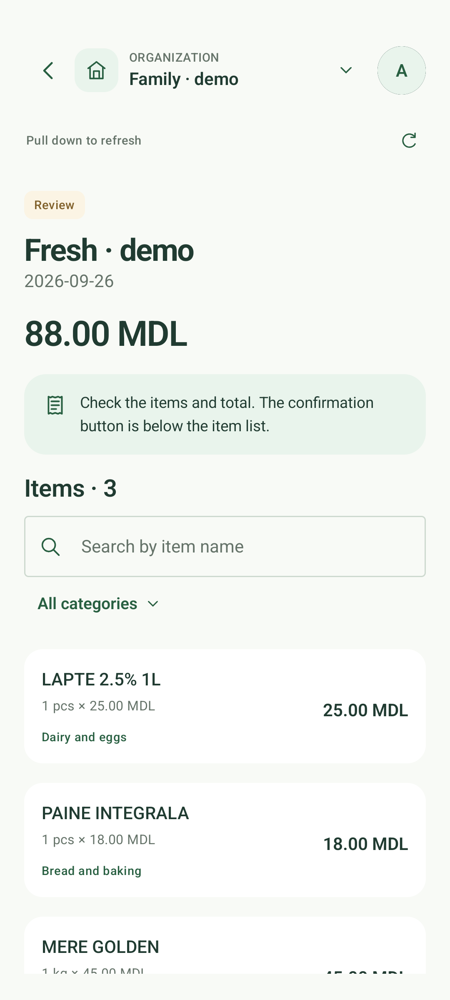
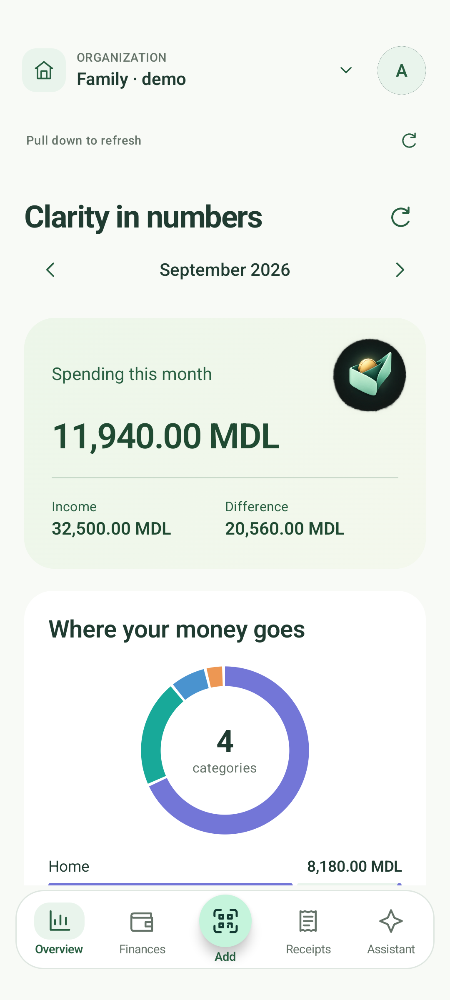
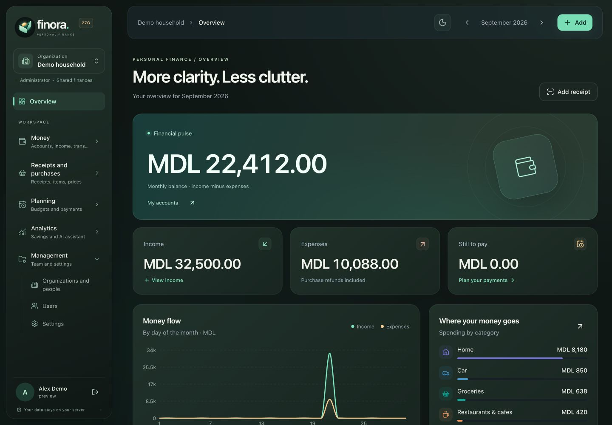
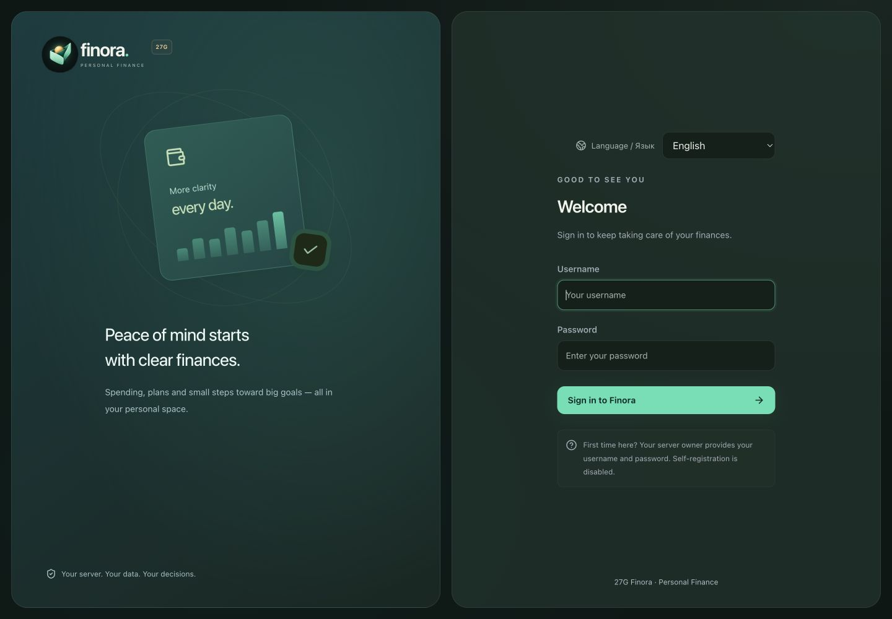
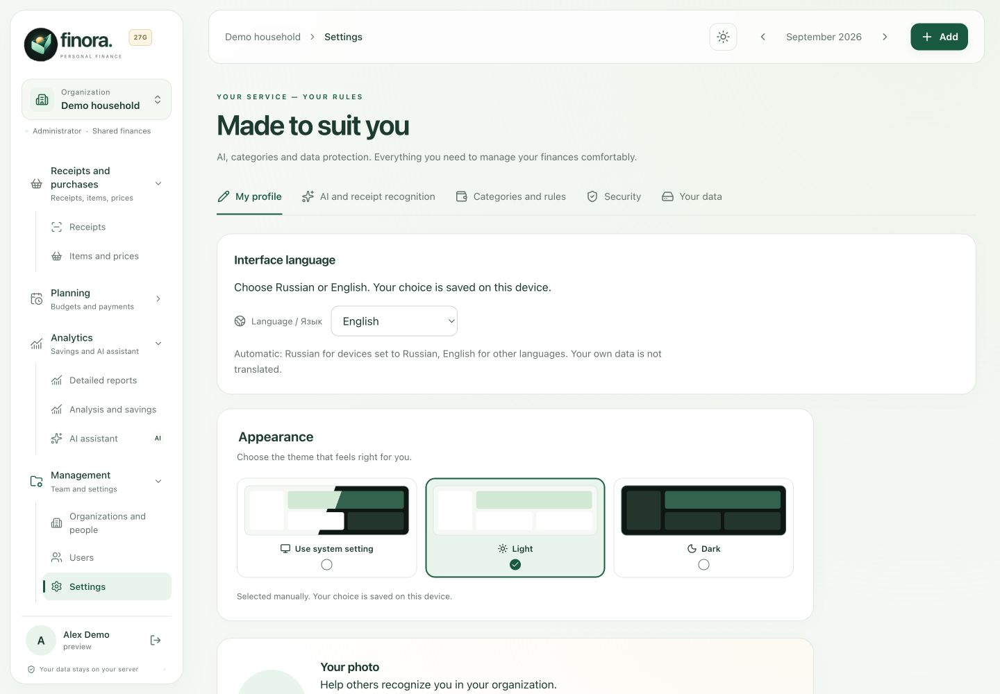
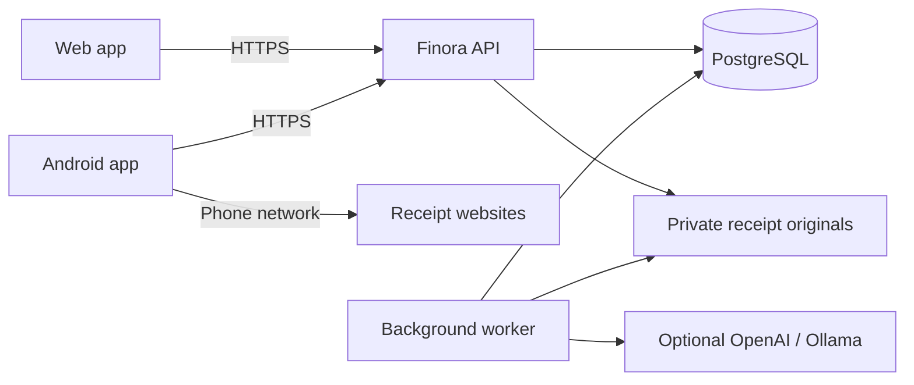

<p align="center">
  
</p>

<h1 align="center">Finora · Personal Finance</h1>
<p align="center"><strong>Turn everyday receipts into a clearer picture of your money.</strong></p>
<p align="center">Scan a purchase. Understand your spending. Plan what comes next.<br />A shared finance workspace that runs on your own server.</p>

<p align="center">
  <a href="https://github.com/gadmin2151/Finora/actions/workflows/ci.yml"></a>
  <a href="https://github.com/gadmin2151/Finora/actions/workflows/android.yml"></a>
  <a href="LICENSE"></a>
  <a href="android/README.md"></a>
  <a href="docs/DEPLOYMENT.md"></a>
</p>

<p align="center">
  <a href="#get-started"><strong>Get started</strong></a> &nbsp;·&nbsp;
  <a href="android/README.md"><strong>Download Android</strong></a> &nbsp;·&nbsp;
  <a href="docs/SHOWCASE.md#en">Screenshot gallery</a> &nbsp;·&nbsp;
  <a href="README.ru.md">Русский</a>
</p>

---

The **current wallet** includes debt repayments and shows balances separately from monthly income. Adjust an account with an auditable add/subtract/set action, and open spending categories to explore their receipt items. [Wallet and chat guide →](docs/WALLET.md)

## Make the little purchases add up to insight

A bank balance tells you how much is left. Finora helps you understand **what you bought, where the money went, and what is still coming up**. Keep the receipt, explore the items behind the total, and share the same picture with your household or team.

|                                 | What you can do                                                                                                                                                           |
| ------------------------------- | ------------------------------------------------------------------------------------------------------------------------------------------------------------------------- |
| **📷 Capture without retyping** | Scan a receipt QR, upload photos, or capture a long receipt from top to bottom on Android. Review the recognized items and total before confirming a mobile import.       |
| **🧾 Go beyond the total**      | Search purchases by name, category, store, date, account, currency or unit. Compare prices paid across your own receipts. Keep the original images alongside the results. |
| **💸 See the whole month**      | Track income, expenses, accounts, transfers, refunds, budgets and scheduled bills. Separate recurring income from occasional payments.                                    |
| **🤝 Keep debts clear**         | Record money lent or borrowed, repay part or all of it, and add to an existing debt. Each movement keeps its account, date and history. Available on web and Android.     |
| **✨ Ask better questions**     | Ask the optional AI assistant about spending, periods and products. Answers come with reports calculated from your organization's records.                                |
| **🏡 Share a workspace**        | Use separate organizations for a household or team. Switch between them with one account, assign roles and manage access from the web.                                    |

## Built for the moment you get the receipt

<table>
  <tr>
    <td align="center" width="33%"><strong>1. Capture</strong><br /><sub>QR, gallery or a vertical scan</sub></td>
    <td align="center" width="33%"><strong>2. Review</strong><br /><sub>Check the items, categories and total</sub></td>
    <td align="center" width="33%"><strong>3. Understand</strong><br /><sub>See the month in one place</sub></td>
  </tr>
  <tr>
    <td><a href="docs/assets/showcase/en/android-capture.png"></a></td>
    <td><a href="docs/assets/showcase/en/android-receipt.png"></a></td>
    <td><a href="docs/assets/showcase/en/android-overview.png"></a></td>
  </tr>
</table>

**You stay in control.** Correct the merchant, address, date, quantities, prices or categories before confirming. Recognition can leave uncertain fields for review; a missing total is never silently replaced with a guess.

The phone opens receipt websites through **its own network**, then sends the page text and screenshots to your Finora server for processing. One server-side AI key can serve your devices. Long-receipt stitching happens locally on the phone. [Capture guide and limitations →](docs/LONG-RECEIPTS.md)

## A workspace that feels like yours

Mint, warm gold and a little more breathing room. Follow your system theme or choose light or dark, independently on each device.

<table>
  <tr>
    <td align="center" width="50%"><strong>Light, clear and calm</strong></td>
    <td align="center" width="50%"><strong>Dark, focused and comfortable</strong></td>
  </tr>
  <tr>
    <td><a href="docs/assets/showcase/en/web-light.jpg"></a></td>
    <td><a href="docs/assets/showcase/en/web-dark.jpg"></a></td>
  </tr>
</table>

<p align="center"><a href="docs/SHOWCASE.md#en"><strong>Explore purchases, reports, the assistant and mobile finances →</strong></a><br /><sub>Actual application screens. All people, organizations and financial records shown are fictional.</sub></p>

## Your language, from the first sign-in

**English and Russian are available in both the web and native Android apps.** Choose a language on the sign-in screen, or change it later under **My profile → Interface language** on the web and **avatar → Language** on Android.

The default **Device language** option uses Russian when the device's primary language is Russian, and English otherwise. An explicit choice is remembered on that browser or phone, including after signing out. Names, receipt contents and other information you enter stay exactly as you entered them.

<table>
<tr><th width="50%">Choose before signing in</th><th width="50%">Change it in your profile</th></tr>
<tr>
<td><a href="docs/assets/showcase/en/web-login.jpg"></a></td>
<td><a href="docs/assets/showcase/en/web-settings.jpg"></a></td>
</tr>
</table>

[English screen gallery](docs/SHOWCASE.md#en) · [Русские экраны](docs/SHOWCASE.md#ru) · [Language guide](docs/LANGUAGES.md#en)

## Ask your records, get the numbers

> “Compare groceries in August and September.”<br />
> “Find my LAPTE purchases.”<br />
> “Where did I pay less for the same product?”

Finora's assistant searches and explains **your own records**. The backend validates the request and calculates reports; the AI adds an explanation. Follow-up questions keep context, and purchase results link back to their receipts.

- **Useful without AI:** preset summaries, category reports and price comparisons work without a provider.
- **Choose your provider:** OpenAI with an encrypted server-side key, or optional Ollama on your own hardware.
- **Read-only by design:** the chat cannot move money, post expenses or delete records.
- **Clear data boundaries:** only the selected organization's data is used. Recognition content and context needed for an answer are sent to the configured provider when AI is enabled.

Price comparisons use historical purchases, not live shop offers. [How the assistant works →](docs/ASSISTANT.md)

## Get started

### Run locally with Docker

Install **Docker with Compose, Git and Python 3.11+**, then:

```bash
git clone https://github.com/gadmin2151/Finora.git
cd Finora
python3 scripts/init.py
python3 scripts/deploy.py
```

Open **[localhost:8088](http://localhost:8088)**. Sign in as `admin` using the random initial password in `.secrets/admin_password`, then change it in **Settings → Security**. There is no shared default password or public registration.

### Put it on your server

The installer supports **Debian 12 / 13** and Docker images for **amd64 / arm64**:

```bash
sudo apt-get update
sudo apt-get install -y git
sudo git clone https://github.com/gadmin2151/Finora.git /opt/finora
cd /opt/finora
sudo ./scripts/install-debian.sh --domain finance.example.com
```

Replace the domain with your own. Caddy needs DNS pointing to the server and ports **80/443** for automatic HTTPS. Prefer a tunnel? Use the [Cloudflare Tunnel guide](README.ru.md#cloudflare-tunnel).

### Connect Android

[**Download the signed APK and view installation instructions →**](android/README.md)

Enter your server's **HTTPS URL**, username and password, then choose an organization. The native app supports receipt capture and review, history, monthly overview, income, debts and the assistant. Administration screens are available in the web interface.

[Installation, updates and recovery](docs/DEPLOYMENT.md) · [Full Russian manual](README.ru.md) · [Configuration reference](.env.example)

## Your server, with clear boundaries

| Area           | Current support                                                                                                                                                           |
| -------------- | ------------------------------------------------------------------------------------------------------------------------------------------------------------------------- |
| **Clients**    | Responsive web interface and native Android 8+. No native iOS app yet.                                                                                                    |
| **Language**   | English and Russian web/Android interfaces; device-language default and a saved manual choice. Receipt recognition is independent of the interface language.                                                                                                              |
| **Money**      | MDL reports; MDL, EUR, USD and RON accounts, with the exchange rate saved on each transaction.                                                                            |
| **Receipts**   | Photos, electronic receipt pages including Moldova's MEV/SFS, multiple photos and bank payment confirmations. Provider availability and image quality affect recognition. |
| **Categories** | 34 everyday presets, including groceries, sweets, coffee, energy drinks, tobacco and household supplies. Custom rules and reclassification of existing receipts.          |
| **Access**     | Organization-scoped data, administrator/member roles, password resets, session revocation and recoverable organization/user deletion.                                     |
| **Data**       | PostgreSQL plus private receipt files on your server. Encrypted backups and a recovery procedure. Records are not end-to-end encrypted.                                   |
| **Banking**    | Manual entry and receipt import. Automatic bank-account synchronization is not included.                                                                                  |

Finora is actively developed. Review recognized data before posting and keep backups of the database, receipt files and server secrets. [Security policy](SECURITY.md) · [Backup and restore](README.ru.md#резервное-копирование-и-восстановление)

## Built to be understood and extended

**FastAPI · PostgreSQL 17 · React / TypeScript · Kotlin / Jetpack Compose · Docker Compose**



Server CI checks tests, migrations, formatting, dependencies and both container architectures before publishing images. Android CI checks formatting, unit tests, release lint and the release build. See the workflows above for the latest results.

| Explore                        | Guide                                                                                                                |
| ------------------------------ | -------------------------------------------------------------------------------------------------------------------- |
| Install, update or restore     | [Deployment](docs/DEPLOYMENT.md) · [Русская инструкция](README.ru.md)                                                |
| Set up your phone              | [Android](android/README.md) · [Long receipts](docs/LONG-RECEIPTS.md)                                                |
| Manage shared finances         | [Organizations and users](docs/MANAGEMENT.md) · [Mobile income and debts](docs/MOBILE-FINANCE.md)                    |
| Choose your interface language | [English and Russian](docs/LANGUAGES.md#en) · [Bilingual screenshots](docs/SHOWCASE.md) |
| Understand the calculations    | [AI and reports](docs/ASSISTANT.md)                                                                                  |
| Contribute or report a problem | [Developer guide](CONTRIBUTING.md) · [Issues](https://github.com/gadmin2151/Finora/issues) · [Security](SECURITY.md) |

Have an idea that makes everyday finance simpler? Open an issue with the use case. Contributions to receipt handling, accessibility, translations and documentation are welcome; use synthetic examples instead of personal financial data.

---

<p align="center"><strong>Your receipts. Your money. Your server.</strong><br />Built by <a href="https://github.com/gadmin2151">gadmin2151</a> · 27G Finora · <a href="LICENSE">MIT license</a></p>
