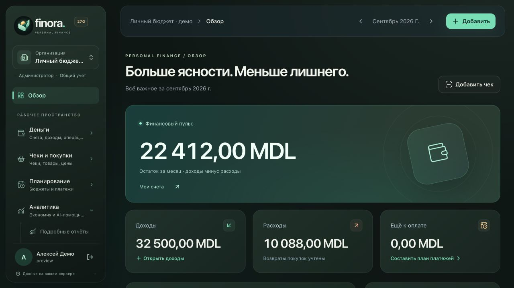
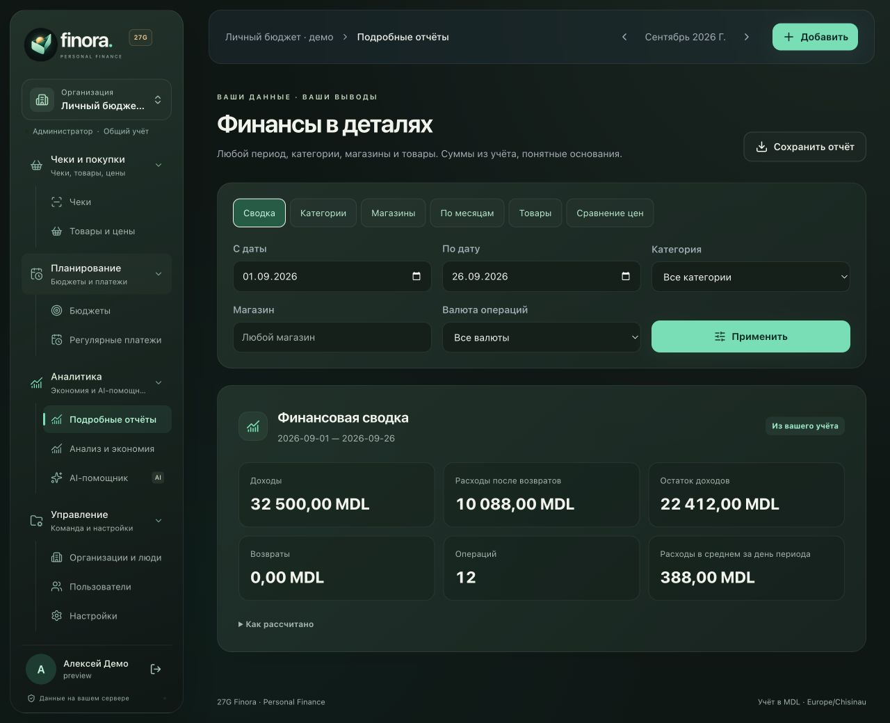
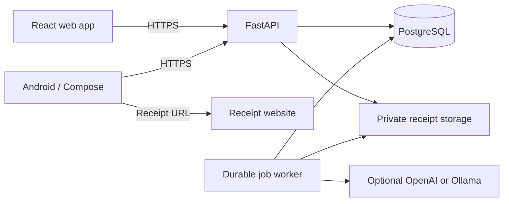

<p align="center">
  
</p>
<h1 align="center">27G Finora · Personal Finance</h1>
<p align="center"><strong>Your receipts. Your money. Your server.</strong></p>
<p align="center">A self-hosted finance workspace with a native Android receipt scanner and an AI assistant grounded in your own records.</p>
<p align="center">
  <a href="https://github.com/gadmin2151/Finora/actions/workflows/ci.yml"></a>
  <a href="https://github.com/gadmin2151/Finora/actions/workflows/android.yml"></a>
  <a href="LICENSE"></a>
</p>
<p align="center"><a href="#get-started">Get started</a> · <a href="android/README.md">Android</a> · <a href="README.ru.md">Русская инструкция</a> · <a href="docs/ASSISTANT.md">AI & reports</a> · <a href="SECURITY.md">Security</a></p>



## Light, dark, or your system · 1.9

Finora follows your device theme by default. Choose **System**, **Light**, or **Dark** using the sun/moon button in the web toolbar (also in Settings), or your avatar → **Appearance** on Android. Each browser or phone remembers its own choice across sessions and organizations. No server configuration or database migration is needed.

## Organizations, people and receipt originals

Manage organizations and users from connected **Organizations / Users** screens. Rename a workspace, invite members, choose roles, reset a password or block sign-in. Deletion moves an organization or account to a recoverable **Trash**; financial history and receipt images are retained. The server owner and the last active administrator of an active organization are protected. Restored accounts stay blocked until you explicitly enable sign-in.

Receipt details include a private **Originals** gallery with zoom and download. Uploaded photos and electronic-page screenshots are retained independently of recognition and financial corrections; rescanning adds new originals without duplicating expenses. You can attach missing photos to older receipts. If a website is unavailable, upload a photo or use the Android scanner on the phone's network. An image that was never saved cannot be reconstructed from extracted text. [Management and retention guide](docs/MANAGEMENT.md).

## New in 1.7: income and debts on Android

The native **Finances** tab handles occasional income, recurring schedules, received payments, lending, borrowing and partial repayments. Existing income can be linked to a planned payment without counting it twice. The five-item navigation puts the larger receipt-capture button in the middle; profile stays under the avatar. [Mobile finance guide](docs/MOBILE-FINANCE.md).

## New in 1.6: scan a long receipt

Move the Android camera from the top of a receipt to the bottom. **Long receipt** mode captures overlapping sections and assembles one vertical photo locally, with pause, full-image review and zoom before upload. No AI key or network connection is needed for stitching. [How it works and its limits](docs/LONG-RECEIPTS.md).

## A clear picture of everyday money

- **One workspace per organization.** Share finances with your household or team. Switch organizations before adding a receipt. Administrators manage money and people; members add receipts, comment and explore statistics.
- **Income, expenses and obligations.** Track accounts, transfers, refunds, recurring and occasional income, monthly budgets, scheduled bills and partial debt repayments.
- **Receipts you can inspect.** Scan a QR, take up to four photos of one receipt, or upload images. Review the merchant, date, currency, items, categories and total before confirming a mobile import.
- **Partial recognition stays useful.** A missing date does not discard the printed total or item list. Android identifies missing fields and offers a **Today** shortcut in the receipt date field; confirmation remains explicit.
- **Useful product history.** Filter by product, category, merchant, date, account, currency or unit. Compare prices actually paid across different receipts, including line discounts.
- **Ask your finances a question.** “Compare groceries in August and September.” “Find my LAPTE purchases.” “Where was it cheaper?” The assistant uses validated, read-only reports and keeps conversation context.
- **Your choice of AI.** OpenAI with a server-side API key, optional Ollama on CPU/RAM, or no AI. Manual finance and preset reports work without an AI provider.

The interface is currently **Russian**; receipt recognition supports Romanian and Russian. Financial reports use **MDL** with the exchange rate stored on each transaction. MDL, EUR, USD and RON accounts are supported. This is an actively developed product, not a bank connection or accounting certification service.

## What's new in 1.5

| Area | Improvement |
|---|---|
| AI assistant | Web and native Android chat, follow-up questions, purchase search, source receipt links and exact report cards |
| Reports | Six report types with date ranges, category, merchant, currency and product filters; text export |
| Recognition | Explicit printed-total detection, a bounded total reread, verified discount allocation and preserved uncertainty |
| Reliability | Worker heartbeats and attempt checks prevent stale jobs from overwriting newer results |
| Security | Streaming request limits, concurrent login throttling, password-reset race protection and dependency audit gates |
| Mobile UX | A dedicated assistant tab, visible refresh/loading, retained drafts and a keyboard-aware composer |

See the [manual audit and verification record](docs/AUDIT-2026-09.md) and [market research](docs/MARKET.md).

## Get started

### Debian 12 server

Use a dedicated server with Docker support, Git and Python 3.11+. The installer can install Docker Engine and Compose from Docker's official repository.

```bash
git clone https://github.com/gadmin2151/Finora.git /opt/finora
cd /opt/finora
sudo ./scripts/install-debian.sh --domain finance.example.com
```

Replace the example domain with your own. For automatic HTTPS through Caddy, point DNS to the server and allow ports 80/443. The API stays on loopback; PostgreSQL is not exposed publicly.

The first account is `admin`. Read its **random initial password** on the server:

```bash
sudo cat /opt/finora/.secrets/admin_password
```

Change it in **Настройки → Безопасность**. The initial-password file is not updated when you change your password. There is no public registration or shared default password.

### Local Docker installation

```bash
git clone https://github.com/gadmin2151/Finora.git
cd Finora
python3 scripts/init.py
python3 scripts/deploy.py
```

Open [localhost:8088](http://localhost:8088). The scripts build the application, initialize secrets, apply migrations and wait for readiness. Docker Desktop works for local development; Android connections require a valid HTTPS endpoint.

### Cloudflare Tunnel

For a server without inbound ports, install with `--port 8080`, then follow the [Cloudflare setup](README.ru.md#cloudflare-tunnel). A token file is mounted into `cloudflared`; tokens do not belong in Compose files, process arguments, screenshots or Git. Keep `APP_URL` equal to your public HTTPS origin and `COOKIE_SECURE=true`.

The [LXC overlay](README.ru.md#ограниченные-lxc-контейнеры) is available for restricted Linux containers. It uses host networking with loopback-only API and PostgreSQL listeners; do not use it as a general Docker default.

## Android: capture, review, confirm

1. Install the signed APK from your deployment or the [Android download page](android/README.md).
2. Enter your server's **HTTPS** address, username and password.
3. Choose an organization, scan a QR or photograph a receipt.
4. Review the returned draft, correct anything necessary, then confirm.

Receipt websites are opened **from the phone's network**. The phone sends page text and captures to Finora for processing; this helps when a fiscal website cannot be reached from your server's country. The server retains the OpenAI key. The application never bypasses certificate errors or website challenges.

Android 8+ is supported. Web administration provides the complete finance-management interface; native Android focuses on receipt capture/review, history, overview, profile and AI chat. Unsupported management screens open the web interface.

## AI with evidence



The assistant selects up to three typed reports, each within a bounded period. The backend validates filters and organization access, calculates the numbers, and returns the exact report alongside the explanation. It cannot run SQL, post expenses, delete records, move money or browse arbitrary sites through chat.

Preset **Summary / Categories / My prices** reports also work with AI disabled. With AI enabled, a free question normally uses one planning request and one explanation request; preset reports use at most one explanation request. A provider failure after calculation still returns the reports.

OpenAI is optional. Configure it in **Настройки → AI**, select models and set the monthly request cap. Data needed for recognition or an answer is sent to the selected provider. Keys are encrypted at rest using your server's `SECRET_KEY`; financial records are not end-to-end encrypted. Read [data handling and limitations](docs/ASSISTANT.md).

## Architecture



FastAPI · SQLAlchemy · Alembic · PostgreSQL 17 · React / TypeScript · Kotlin / Jetpack Compose · CameraX / ML Kit · Docker Compose.

| Component | Responsibility |
|---|---|
| `backend/app/finance.py` | Ledger, amounts, account balances and budgets |
| `backend/app/receipts.py` | Extraction, validation, editable review and confirmation |
| `backend/app/analytics.py` | Deterministic, organization-scoped reports |
| `backend/app/assistant.py` | Read-only query planning and grounded explanations |
| `backend/app/worker.py` | Durable jobs, recovery and active-attempt fencing |
| `web/` / `android/` | Responsive web interface and native Android client |
| `scripts/` | Installation, upgrade, encrypted backup and isolated restore |

## Updates and recovery

Back up **both** the database/receipt files and the recovery identity. Keep `.env`, `.secrets` and named volumes; a new `SECRET_KEY` cannot decrypt your existing AI keys.

```bash
git pull --ff-only
sudo python3 scripts/deploy.py
```

The deploy script creates an encrypted backup before an update, runs migrations and verifies readiness. It does not automatically select a different image tag. For controlled deployments set `FINORA_IMAGE` to a reviewed immutable GHCR digest in `.env`; use the same image for API, worker and init.

See [backup and isolated restore instructions](README.ru.md#резервное-копирование-и-восстановление). Rehearse restoration on a separate installation before relying on a backup. Backups contain sensitive data; publish neither archives nor recovery keys.

## Builds and contribution

Server CI runs PostgreSQL integration tests, migration checks, lint/format checks, installer tests, dependency audits and the web build. Both **amd64 and arm64** images are booted and tested through authenticated API calls before a multi-platform tag is published. Android CI checks formatting, unit tests, release lint and an R8 release build. Signing requires the repository's configured signing secrets; an unsigned CI APK is not an installable release.

[Developer guide](CONTRIBUTING.md) · [configuration reference](.env.example) · [security policy](SECURITY.md) · [Android verification](android/VERIFICATION.md)

## License

[MIT](LICENSE). Screenshots in this README use fictional demonstration data. Finora is independent of fiscal providers and the products discussed in the market research.

### Everyday categories and existing receipts

New organizations start with 34 categories, including groceries, sweets, coffee and tea, energy drinks, tobacco, household supplies and personal care. Organization admins can install the additional presets and reclassify existing receipts under **Settings → Categories and rules**. Reclassification applies explicit user rules first, preserves custom categories and unknown assignments, and updates the category allocations used by reports. It does not change money, account postings, currencies or receipt originals. Drafts remain drafts. Refund-linked receipts and inconsistent monetary records are skipped with an explanation instead of guessing.

Receipt recognition separates the printed seller and address from products and fiscal identifiers, including full SFS pages captured by a phone. Existing contaminated names are repaired only when the original text has a unique matching quantity, price and line total. Changes are audited. The optional `merchant_address` API field is backward compatible and stored in existing receipt metadata; no database schema migration is required.

The organization-scoped admin endpoints are `POST /api/categories/daily` and `POST /api/categories/refresh` with `{ "after": "" }`. Refresh processes up to 50 receipts per request; pass `next_cursor` as `after` until it is null. A repeated run is safe.

Bank payment confirmations can also be uploaded as photos or screenshots. Recognition distinguishes the charged amount/currency from the original transaction currency, extracts the payee/date/status, and represents the payment as one line. It never counts both currencies as expenses or invents purchased products. Bank confirmations always require review, including pending or declined payments; existing manually posted records are not reprocessed.
