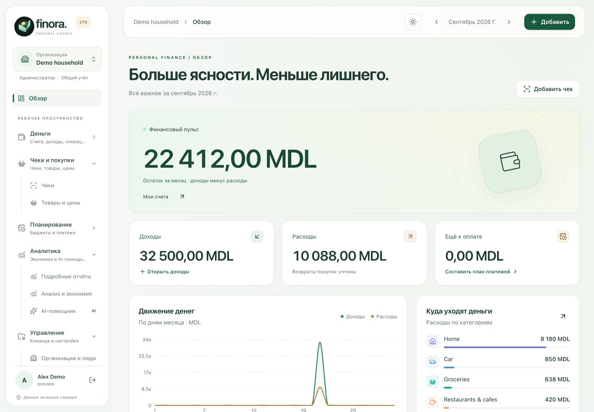
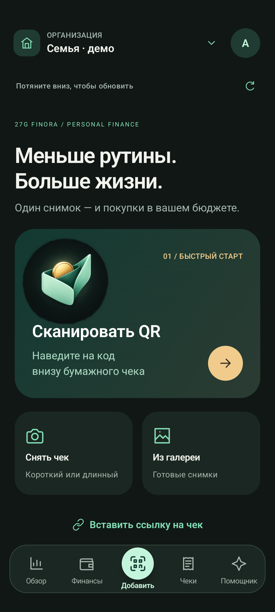
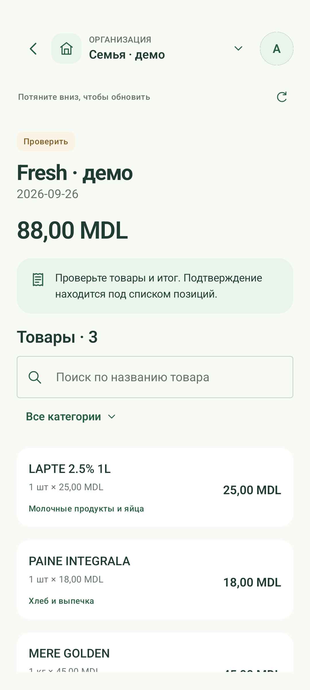
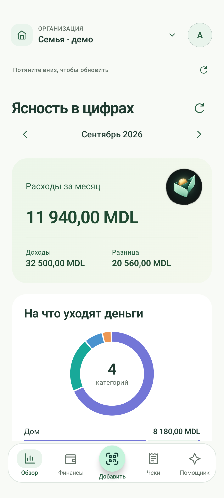
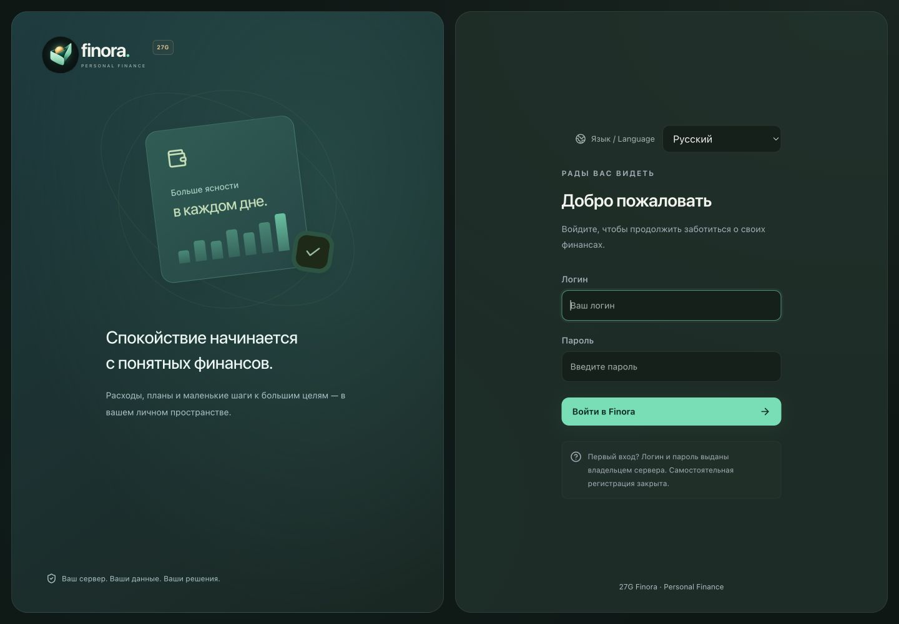
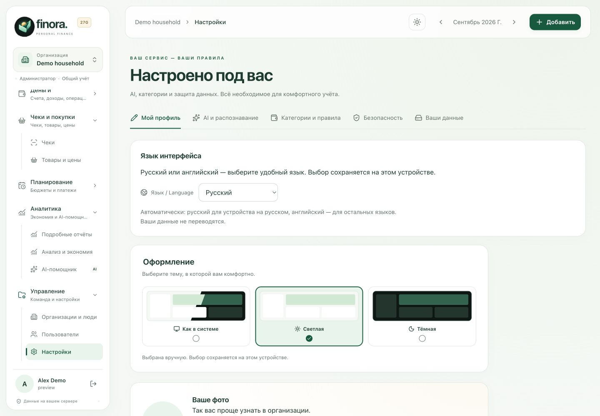

<p align="center"></p>

<h1 align="center">Finora · Personal Finance</h1>
<p align="center"><strong>Больше ясности в деньгах. Меньше рутины с чеками.</strong><br />Ваши покупки, доходы, планы и долги — на вашем сервере.</p>

<p align="center">
<a href="https://github.com/gadmin2151/Finora/actions/workflows/ci.yml"></a>
<a href="https://github.com/gadmin2151/Finora/actions/workflows/android.yml"></a>
<a href="LICENSE"></a>
</p>

<p align="center"><a href="#установка-на-debian"><strong>Установить на сервер</strong></a> · <a href="android/README.md"><strong>Скачать Android</strong></a> · <a href="docs/SHOWCASE.md#ru">Галерея экранов</a> · <a href="README.md">English</a></p>

**Текущий кошелёк** учитывает возвраты долгов и показывает остатки отдельно от доходов месяца. Остаток можно уточнить с записью в историю, а категории расходов открыть до списка товаров. [Кошелёк и чат →](docs/WALLET.md)

## Финансы, которые можно понять

Finora помогает увидеть, что стоит за общей суммой: какие товары вы покупаете, как меняются цены и сколько останется после обязательных платежей. Общая история семьи или команды хранится внутри организации; один пользователь может переключаться между несколькими пространствами.

| Возможность                  | Для чего                                                                                                                                           |
| ---------------------------- | -------------------------------------------------------------------------------------------------------------------------------------------------- |
| **Чеки без перепечатывания** | QR, фото, несколько частей или вертикальная съёмка длинного чека на Android. Проверка и исправление распознанных данных перед подтверждением.      |
| **Товары и цены**            | Поиск по названию, категории, магазину и периоду. Сравнение цен из собственных чеков, 34 повседневные категории и сохранённые оригиналы.           |
| **Картина месяца**           | Доходы, расходы, счета, переводы, возвраты, бюджеты и обязательные платежи. Регулярные и разовые поступления.                                      |
| **Понятные долги**           | Дал или взял в долг, погасил частично или полностью, увеличил долг. История движений на сайте и телефоне.                                          |
| **Помощник с расчётами**     | Вопросы о расходах, сравнение периодов и поиск покупок. Готовые отчёты работают без AI; для свободного диалога можно подключить OpenAI или Ollama. |
| **Общий учёт с правами**     | Организации, администраторы и участники, управление пользователями, сброс паролей и восстановление из корзины.                                     |

<table>
<tr><th width="33%">Снять</th><th width="33%">Проверить</th><th width="33%">Разобраться</th></tr>
<tr>
<td></td>
<td></td>
<td></td>
</tr>
</table>

Все изображения — реальные экраны приложения с вымышленными данными. [Посмотреть светлый и тёмный веб, отчёты, товары и долги →](docs/SHOWCASE.md#ru)

## Наличные и карты: отдельно или вместе · 1.13

На сайте: **Настройки → Учёт денег**. На Android: **аватар → Учёт денег**. Администратор выбирает режим для всей организации. В режиме **«Всё вместе»** виден общий остаток, новые чеки, доходы и движения долгов в MDL записываются на выбранный основной счёт MDL. Другие валюты остаются отдельно. Можно перенести существующие чеки MDL: меняется счёт и проводка, суммы, товары, категории и оригиналы сохраняются. Повторные расходы не создаются. Старые операции без чека остаются на исходных счетах и входят в общий остаток; их можно посмотреть через «Показать счета». Возврат в раздельный режим не отменяет перенос старых чеков.

## Чек вручную — без фото и QR

Администратор организации может зарегистрировать чек без фотографии, QR-кода, AI и импортированной банковской операции. На сайте: **Чеки → Добавить чек → Вручную**. В Android 1.12+: центральная вкладка **Добавить → Чек вручную**.

Укажите магазин, дату, счёт оплаты и товары. Сумма строки считается из количества и цены; для скидки её можно изменить. После подтверждения чек и товары попадают в аналитику, а итог учитывается одним расходом выбранного счёта. Фото можно прикрепить позже. Повторная отправка после обрыва связи не создаёт второй расход. Доступ обычных участников к загрузке и проверке чеков не меняется.

## На русском и английском — с первого входа

**Сайт и нативное Android-приложение доступны на русском и английском.** Переключатель есть на экране входа. Позже язык можно изменить на сайте в **Мой профиль → Язык интерфейса**, а на Android — через **аватар → Язык**.

По умолчанию выбран **Язык устройства**: русский, если основной язык браузера или телефона русский; для остальных языков — английский. Ручной выбор сохраняется отдельно в этом браузере или на этом телефоне, в том числе после выхода из аккаунта. Названия организаций, счетов, товаров, содержимое чеков и другие ваши данные не переводятся.

<table>
<tr><th width="50%">Выбор языка до входа</th><th width="50%">Язык и оформление в профиле</th></tr>
<tr>
<td><a href="docs/assets/showcase/ru/web-login.jpg"></a></td>
<td><a href="docs/assets/showcase/ru/web-settings.jpg"></a></td>
</tr>
</table>

[Галерея на русском](docs/SHOWCASE.md#ru) · [English screenshots](docs/SHOWCASE.md#en) · [Как работает выбор языка](docs/LANGUAGES.md#ru)

## Навигация по инструкции

- [Установка на Debian](#установка-на-debian) · [Локальный запуск](#локальный-запуск-из-исходников) · [Cloudflare Tunnel](#cloudflare-tunnel)
- [Организации и права](#организации-и-права-доступа) · [Приложение Android](android/README.md) · [Русский и английский](docs/LANGUAGES.md#ru)
- [Обновление](#обновление) · [Резервное копирование](#резервное-копирование-и-восстановление)
- [CI/CD и образы](#cicd-и-образы) · [Разработка](#разработка-и-проверки) · [Ограничения](#ограничения)

<details>
<summary><strong>Подробности возможностей и совместимости версий</strong></summary>

## Светлая и тёмная темы · 1.9

По умолчанию сайт и Android следуют оформлению устройства. На сайте значок солнца/луны в верхней панели сразу переключает светлую и тёмную темы. В профиле сайта и на телефоне через аватар → **Оформление** доступны **Как в системе**, **Светлая** и **Тёмная**. Выбор сохраняется отдельно в каждом браузере и телефоне, включая повторный вход и смену организации. Камера остаётся тёмной, чтобы элементы управления были видны поверх изображения.

В разделе **Долги** на сайте и Android доступны **Погасить частично**, **Погасить полностью** и **Увеличить долг**. Выберите счёт, дату и при необходимости примечание. Полное погашение подставляет весь остаток; увеличение записывает дополнительную передачу денег по тому же долгу, в том числе закрытому. Все движения сохраняются в истории операций и меняют баланс счёта, но не считаются доходами или расходами. Повтор запроса не дублирует платёж; если остаток изменился во время полного погашения, обновите список перед подтверждением. Изменение долгов доступно администраторам организации, новая схема БД не требуется.

## Доходы и долги на Android · 1.7

В нижнем меню появился раздел **Финансы**: разовые и регулярные доходы, план поступлений, история, выдача и получение долгов, частичные возвраты. Большая центральная кнопка добавляет чек; профиль открывается по аватарке. [Подробная инструкция](docs/MOBILE-FINANCE.md).

## Длинный чек · Android 1.6

В разделе добавления появился режим **«Длинный чек»**. Плавно ведите камеру сверху вниз: телефон захватывает перекрывающиеся фрагменты и склеивает их в один снимок без AI и интернета. Нажмите «Готово», проверьте результат с прокруткой и увеличением, затем «Использовать». Распознавание и подтверждение проходят через обычный черновик. [Инструкция](docs/LONG-RECEIPTS.md).

## Обновление 1.5.0

Добавлены подробные отчёты и новый AI-чат в вебе и Android: сравнение периодов, поиск покупок, история диалога, точные расчёты и переход к исходным чекам. Быстрые отчёты работают без AI. Обычный участник организации может спрашивать статистику; права на изменение финансов не расширены.

Распознавание проверяет напечатанный итог и при необходимости отдельно читает явную скидку. Распределение скидки выполняется только при точном совпадении с разницей сумм, остаётся на проверку и сохраняет исходные значения. Исправлены конкурентные проверки входа/смены пароля, добавлено ограничение реальных байтов запроса и защита от записи результата устаревшей фоновой задачи.

[Как пользоваться помощником и понимать отчёты](docs/ASSISTANT.md) · [Исследование рынка](docs/MARKET.md) · [Аудит и проверки](docs/AUDIT-2026-09.md).

## Управление организациями, пользователями и оригиналами

В разделе **Организации** выберите карточку слева: справа доступны переименование, участники, роли и удаление. Кнопка **Открыть учёт** отдельно переключает финансовое пространство. В **Корзине** можно восстановить организацию со всей историей. Управление доступно и на экране выбора организации — даже если действующих организаций больше нет.

В **Пользователях** владелец сервера видит отдельные действия **Профиль**, **Организации**, **Пароль**, **Заблокировать** и **Удалить**. Удаление закрывает вход и отзывает сеансы, сохраняя авторство чеков и комментариев. В фильтре **Корзина** можно восстановить аккаунт; затем проверьте организации и нажмите **Включить вход**. Владельца сервера удалить нельзя; у каждой действующей организации должен оставаться активный администратор.

В каждом чеке есть **Оригиналы чека**: фото и сохранённые снимки страницы с увеличением и скачиванием. Повторная загрузка не удаляет прежние снимки. Через **Прикрепить** можно дополнить старый чек без изменения сумм и товаров. Если оригинал раньше не сохранялся, он явно отмечен как отсутствующий: потребуется фото или снимок страницы, восстановить изображение из распознанного текста невозможно.

Миграция `9ad271c084fe` добавляет корзину без удаления истории. [Подробности, права и ограничения](docs/MANAGEMENT.md).

## Обновление 1.4.0

- Цельная палитра 27G Finora: графит, мягкий светлый текст и мятные акценты. Объёмный кошелёк-оригами с золотой монетой — новый знак приложения, загрузки и веб-версии.
- В Android потяните экран вниз: обновятся данные текущего раздела или открытого чека. Анимированный индикатор 27G показывает загрузку; после ответа появляется время обновления. Повторные жесты объединяются, запрос ограничен 30 секундами; при ошибке прежние данные и черновик остаются.
- **Управление → Пользователи** для владельца сервера: создание аккаунтов, поиск и фильтр статуса, изменение имени, включение/блокировка, сброс пароля, назначение нескольких организаций и ролей. Пароль задаётся от 12 символов. Сброс и блокировка отзывают все сеансы пользователя; заблокированные аккаунты сохраняют финансовую историю.
- **Настройки → Мой профиль** и профиль Android: загрузка/замена/удаление фотографии. JPEG, PNG, WebP, HEIC до 5 МБ; квадрат по центру, нормализация до 512×512, удаление метаданных. Фото доступно самому пользователю, участникам общих организаций и владельцу сервера.

Миграция `7c9120efab34` добавляет статус аккаунта, владельца сервера, аватар и журнал изменений пользователей. Существующий владелец определяется однократно по `ADMIN_USERNAME`; проверьте это значение перед обновлением. Остальные администраторы управляют только своими организациями и не могут сбрасывать общий пароль чужого аккаунта. Владелец не получает членство в чужих организациях автоматически. Последнего активного администратора организации нельзя исключить или заблокировать. Финансовая схема и API чеков совместимы с предыдущим Android.

## Обновление 1.3.0

Единый тёмный интерфейс веба и Android: мятные акценты Finora, полупрозрачные панели, сгруппированное меню и плавные переходы. Учитывается системное уменьшение анимации. Название приложения — **27G Finora · Personal Finance**; application ID и ключ подписи сохранены, обновление устанавливается поверх предыдущего APK.

Для фото AI получает полный снимок вместе с увеличенными фрагментами: сумма справа от `TOTAL` больше не исключается обрезкой. Если итог не прочитан или отличается от суммы строк, выполняется не более одного дополнительного AI-запроса для чтения напечатанного итога. Он учитывается в лимите запросов организации. Сумма не вычисляется вместо отсутствующего `TOTAL`; внесённые наличные, сдача, налоги и скидки не подменяют итог. Неоднозначные данные остаются на проверку пользователю. Сайты чеков по-прежнему открывает телефон.

## Приложение Android

Нативный клиент для Android 8+: HTTPS-вход на свой сервер, выбор организации, QR электронных чеков, съёмка одного чека несколькими фотографиями, сохранение черновика, история и месячная статистика. После распознавания приложение показывает магазин, дату, позиции с количеством и ценами, категории и итог. Страницы чеков открывает телефон через своё соединение и передаёт текст и полный снимок серверу с общим AI-ключом. Перед подтверждением можно исправить все данные и позиции. Расход создаётся только после подтверждения. Исходники, подписанный APK и проверки — в [android/README.md](android/README.md). Дополнительный AI на телефоне не требуется.

</details>

## Установка на Debian

Поддерживаются **Debian 12 и 13**, архитектуры **AMD64 и ARM64**, сервер с systemd. Нужны доступ к интернету, права sudo, свободное место для PostgreSQL и фотографий. Для сервиса без AI ориентир — от 2 ГБ RAM; для локальных моделей 4B — 12–16 ГБ RAM на сервере и дополнительное место для моделей.

```bash
sudo apt-get update
sudo apt-get install -y git
sudo git clone https://github.com/gadmin2151/Finora.git /opt/finora
cd /opt/finora
sudo ./scripts/install-debian.sh --domain finance.example.com
```

Замените домен своим и заранее направьте его DNS на сервер. Для автоматического HTTPS через Caddy должны быть доступны порты **80 и 443**. API остаётся на loopback, PostgreSQL и Ollama не публикуют порты наружу.

Установщик устанавливает Docker Engine и Compose plugin через [официальный APT-репозиторий Docker](https://docs.docker.com/engine/install/debian/), если Docker ещё отсутствует; существующий контейнерный runtime автоматически не удаляет. Затем создаёт уникальные секреты, скачивает готовый образ, применяет миграции и ждёт готовности API и БД. Установка выполняется в текущем клоне; не удаляйте его `.env` и `.secrets`.

Первый вход: **`admin`**. Посмотреть случайный начальный пароль:

```bash
sudo cat /opt/finora/.secrets/admin_password
```

После входа измените пароль в «Настройки → Безопасность». Файл содержит только первоначальный пароль и после смены не обновляется. Дополнительные аккаунты создаются администратором организации. Публичной регистрации и общего встроенного пароля нет.

Варианты первого запуска:

```bash
# Без домена: доступ только на самом сервере или через SSH-туннель.
sudo ./scripts/install-debian.sh

# HTTPS и локальный AI на CPU/RAM; модель выбирается и скачивается в интерфейсе.
sudo ./scripts/install-debian.sh --domain finance.example.com --local-ai

# Собрать образ из исходников вместо скачивания из GHCR.
sudo ./scripts/install-debian.sh --domain finance.example.com --build

# Использовать конкретный опубликованный образ.
sudo ./scripts/install-debian.sh --image ghcr.io/gadmin2151/finora:sha-<12-символов-коммита>
```

Последний пример содержит placeholder: подставьте реальный тег из GitHub Actions. Без домена адрес — `http://localhost:8088`; для удалённого доступа создайте на своём компьютере туннель `ssh -L 8088:127.0.0.1:8088 user@server`.

Параметры `--domain`, `--port`, `--image`, `--local-ai` настраивают **новую установку**. Повторный запуск сохраняет существующие `.env`, пароли и данные, а перед обновлением создаёт резервную копию. Для изменения действующей конфигурации отредактируйте `.env` и выполните `sudo python3 scripts/deploy.py`.

Если GHCR возвращает `denied`, образ может ещё собираться или пакет закрыт: см. [CI/CD и образы](#cicd-и-образы). Для первого запуска без доступа к registry используйте `--build` в новой установке либо `FINORA_IMAGE=finora:local` в существующей `.env`.

## Cloudflare Tunnel

На Linux можно использовать [`compose.cloudflare.yaml`](compose.cloudflare.yaml) вместо Caddy. Входящие порты 80/443 не требуются. Сначала установите сервис с `sudo ./scripts/install-debian.sh --port 8080`, затем задайте в `.env`:

```dotenv
COMPOSE_FILE=compose.yaml:compose.cloudflare.yaml
COMPOSE_PROFILES=
APP_PORT=8080
BIND_ADDRESS=127.0.0.1
APP_URL=https://finance.example.com
COOKIE_SECURE=true
```

Сохраните токен туннеля в `.secrets/cloudflare_tunnel_token` без кавычек. Файл должен принадлежать UID/GID `65532:65532` и иметь права `0400`; каталог `.secrets` остаётся `0700`. Токен передаётся через [token-file](https://developers.cloudflare.com/cloudflare-one/networks/connectors/cloudflare-tunnel/configure-tunnels/run-parameters/#token-file), а не в аргументах процесса или переменных окружения.

В Cloudflare настройте публичный hostname `finance.example.com` с сервисом `http://localhost:8080`. Контейнер туннеля использует сеть Linux-хоста, поэтому этот адрес совпадает с портом Finora. Затем выполните `sudo python3 scripts/deploy.py`. Проверка соединения: `curl --fail http://127.0.0.1:20241/ready` и вход через публичный HTTPS-домен. Для фиксации версии образа можно задать `CLOUDFLARED_IMAGE=cloudflare/cloudflared@sha256:...`.

Приложение и туннель автоматически запускаются Docker после перезагрузки. Резервная копия содержит данные и ключ шифрования Finora; токен Cloudflare храните отдельно. При восстановлении туннель отключён до повторной настройки, чтобы две установки не обслуживали один домен.

### Ограниченные LXC-контейнеры

Если Docker внутри LXC получает `permission denied` при обращении к `net.ipv4.ip_unprivileged_port_start`, предпочтительно исправить конфигурацию/обновить LXC на гипервизоре. Для выделенного Linux-контейнера Finora предусмотрен [`compose.lxc.yaml`](compose.lxc.yaml): добавьте его последним в `COMPOSE_FILE=compose.yaml:compose.cloudflare.yaml:compose.lxc.yaml`. Используется сеть хоста, PostgreSQL слушает только `127.0.0.1:5432`, API — только `127.0.0.1:APP_PORT`; наружу доступ предоставляет туннель. Порт 5432 должен быть свободен. Контейнеры сохраняют обычные ограничения прав, без privileged-режима. На одном таком хосте допускается одна установка с этой конфигурацией; проверку восстановления в отдельный проект выполняйте на другом Docker-хосте/VM с поддержкой сетевых namespace. Не отключайте защиту и не понижайте версию runtime ради запуска.

## Локальный запуск из исходников

Docker Engine / Docker Desktop с Compose plugin, Python **3.11+** для управляющих скриптов. Сервер внутри образа использует Python 3.12; Node.js и Python-зависимости на хост для запуска не нужны.

```bash
git clone https://github.com/gadmin2151/Finora.git
cd Finora
python3 scripts/init.py
python3 scripts/deploy.py
```

Откройте [localhost:8088](http://localhost:8088). Скрипт соберёт `finora:local`, выполнит миграции и запустит приложение. Для базового первого запуска также подходит `docker compose up -d --build --wait`; для **обновлений** используйте `scripts/deploy.py`, который каждый раз явно запускает миграции и делает копию.

## Сервисы и конфигурация

Основной файл — [`compose.yaml`](compose.yaml); HTTPS добавляется файлом [`compose.tls.yaml`](compose.tls.yaml). Docker Compose автоматически читает `COMPOSE_FILE` и `COMPOSE_PROFILES` из сгенерированной `.env`.

| Сервис   | Назначение                      | Хранение / сеть                                      |
| -------- | ------------------------------- | ---------------------------------------------------- |
| `api`    | Веб-интерфейс, API, авторизация | `receipt_data`; `127.0.0.1:8088`                     |
| `worker` | OCR, MEV, очередь распознавания | Общий `receipt_data`; без внешнего порта             |
| `init`   | Alembic и первый администратор  | Одноразовый контейнер                                |
| `db`     | PostgreSQL 17                   | `postgres_data`; только внутренняя сеть              |
| `ollama` | Необязательный локальный AI     | Профиль `local-ai`, том `model_data`                 |
| `caddy`  | HTTPS и reverse proxy           | HTTPS overlay; 80/443, `caddy_data` и `caddy_config` |

Веб-сервер и worker работают от UID **10001**, без root. Инициализация читает файл первого пароля от root. У контейнеров заданы лимиты памяти, ротация логов, restart policy; у API и PostgreSQL — healthcheck.

[`.env.example`](.env.example) — справочник параметров, без действующих секретов. Настоящий файл создаёт `scripts/init.py` с правами 0600.

| Параметр                             | Назначение                                                                                  |
| ------------------------------------ | ------------------------------------------------------------------------------------------- |
| `FINORA_IMAGE`                       | `finora:local` для локальной сборки либо тег/digest GHCR; одинаковый для API, worker и init |
| `COMPOSE_PROJECT_NAME`               | Пространство имён контейнеров и томов; не меняйте у действующей установки                   |
| `COMPOSE_FILE`                       | `compose.yaml` или `compose.yaml:compose.tls.yaml`                                          |
| `COMPOSE_PROFILES`                   | Пусто или `local-ai`                                                                        |
| `APP_PORT`, `BIND_ADDRESS`           | HTTP-порт хоста и привязка; по умолчанию 8088 и 127.0.0.1                                   |
| `APP_URL`                            | Точный адрес браузера для проверки Origin, например `https://finance.example.com`           |
| `DOMAIN`, `COOKIE_SECURE`            | Домен Caddy; для HTTPS `COOKIE_SECURE=true`                                                 |
| `POSTGRES_PASSWORD`                  | Случайный пароль БД; изменение `.env` само по себе не меняет пароль в существующей БД       |
| `SECRET_KEY`                         | Шифрование сохранённых API-ключей; потеря или замена нарушает их расшифровку                |
| `OLLAMA_URL`                         | Адрес Ollama, по умолчанию `http://ollama:11434`                                            |
| `AI_TIMEOUT`, `AI_CPU_THREADS`       | Таймаут и CPU-потоки AI; 480 секунд и 4 потока по умолчанию                                 |
| `OLLAMA_MEMORY_LIMIT`, `OLLAMA_CPUS` | Лимиты Ollama; по умолчанию 6g и 4 CPU                                                      |

`APP_URL` должен совпадать с адресом открытого приложения, включая схему и порт. Иначе сервер отклоняет запись. Файлы `.env`, `.secrets`, резервные копии и локальные данные исключены из Git и контекста Docker build.

## Что работает

- Счета в MDL, EUR, USD и RON, начальные остатки, архивирование, переименование.
- Доходы, расходы, переводы, частичные возвраты покупок, редактирование обычных операций, отмена с журналом. Разделение расхода по категориям.
- Обзор месяца, график, сравнение с предыдущим периодом, фильтры и поиск по всей истории, бюджеты категорий.
- Долги в обе стороны: новый заём с движением денег или ранее возникший долг без повторного движения; частичные возвраты; сроки и закрытые долги.
- Регулярные и разовые обязательства: еженедельно, ежемесячно, ежеквартально, ежегодно. План и фактическая оплата разделены; пропуск и остановка шаблона.
- Чат внутри приложения: фото одного чека (до четырёх частей), камера телефона, QR на фото или HTTPS-ссылка электронного чека; история сообщений и карточки товаров.
- Сохранение оригинала фото, локальный OCR (румынский, русский, английский), распознавание магазина, даты, товаров, количества и цен, категории строк. Если простой формат не прочитан, подключается выбранная AI-модель. Проверка сумм, защита от повторного файла/QR, проверка похожих расходов.
- Автоматическое добавление полностью проверенных чеков или ручное подтверждение; исправление черновика и привязка к уже внесённой покупке.
- Правила категорий по словам в товаре/магазине; они имеют приоритет над AI. Неопределённые товары требуют проверки.
- Анализ превышений бюджета и изменений расходов, сценарии сокращения трат, сравнение наблюдавшихся цен одинаковых товаров. AI объясняет факты и предлагает бытовые замены с обозначением предположений.
- Выбор локального AI / OpenAI / работы без AI, отдельная модель для фотографий, загрузка моделей и статус задач, лимит запросов, учёт токенов.
- Смена пароля, управление сеансами, CSRF и Origin-проверки, Argon2, ограничение попыток входа, журнал, CSV и JSON, зашифрованные резервные копии.

Сервис **учитывает** деньги; банковские переводы и платежи он не выполняет. Доходы минус расходы — денежный результат периода, а не бухгалтерская прибыль. Выдача/получение/возврат долга и переводы между своими счетами не входят в доходы/расходы. Возврат покупки уменьшает расходы в месяце возврата.

## Организации и права доступа

В боковом меню разделы собраны в пять раскрывающихся групп: «Деньги», «Чеки и покупки», «Планирование», «Аналитика» и «Управление». Текущий раздел выделен; при переходе по ссылке его группа открывается автоматически. «Товары и цены» — фильтрация покупок и сравнение цен. Недоступные роли пункты не отображаются.

Нажмите карточку организации над меню, чтобы открыть список организаций с вашими ролями; при количестве больше пяти доступен поиск. Ссылка «Организации и участники» ведёт к управлению составом. На телефоне меню открывается кнопкой в верхней панели; его можно закрыть крестиком, нажатием вне панели или Escape. Фокус клавиатуры остаётся внутри открытого меню и возвращается к кнопке после закрытия.

После входа выберите организацию. Переключатель в меню меняет общую историю, счета, категории, доходы, покупки и настройки AI. Один логин может состоять в нескольких организациях с разными ролями. При переключении локальный кэш предыдущей организации очищается, незавершённые ответы старого контекста отбрасываются. При отправке чека организация явно указана в окне загрузки; задача распознавания сохраняет её идентификатор.

В «Управление → Организации и люди» администратор создаёт организацию, меняет её название, добавляет существующих участников по логину или создаёт новые аккаунты с паролем от 12 символов. Участнику можно изменить роль или закрыть доступ к одной организации. Последнего администратора удалить или понизить нельзя. Самостоятельной регистрации нет.

| Возможность                                              | Администратор         | Пользователь        |
| -------------------------------------------------------- | --------------------- | ------------------- |
| Просмотр общей статистики, покупок и чеков               | Да                    | Да                  |
| Подробные отчёты и вопросы AI о своей организации        | Да                    | Да                  |
| Добавление фото/ссылки чека, комментарии                 | Да                    | Да                  |
| Подтверждение распознанных данных без изменения цен      | Любой чек организации | Только свой чек     |
| Исправление и подтверждение черновика                    | Любой чек организации | Только свой чек     |
| Доходы, ручные операции, планы, счета и категории        | Управление            | Просмотр статистики |
| Удаление чека и товара, настройки AI, экспорт, участники | Да                    | Нет                 |
| Свой пароль и собственные сеансы                         | Да                    | Да                  |

Проверенный чек пользователя может автоматически попасть в учёт по настройкам организации. Спорный результат подтверждает администратор. В карточке чека доступны комментарии с автором и временем. Удаление всего чека отменяет связанный расход; удаление товара пересчитывает сумму, проводку и категории. Оригинальная фотография и аудит сохраняются. Последний товар требует удаления чека целиком; при связанных возвратах сначала отмените возвраты. Во время распознавания удаление заблокировано.

## QR-ссылки и подтверждение на телефоне

В Android 1.2 страницу из QR открывает **сам телефон** через своё интернет-соединение. Он передаёт серверу видимый текст и полный снимок страницы, при необходимости разбитый на четыре части. Сервер распознаёт переданные данные общим ключом OpenAI организации и возвращает черновик. Для такого источника сервер никогда не открывает ссылку, включая повторную обработку. Фото из мобильного приложения также отправляются с `resolve_qr=false`. Это позволяет размещать сервер за пределами Молдовы, где сайт чека может быть недоступен.

На телефоне можно сверить и исправить магазин, дату, валюту, счёт, курс, названия товаров, количество, единицы, цены, суммы строк, категории и итог. Все мобильные чеки имеют `review_required=true`; финансовый расход создаётся только после подтверждения. Сумма строк должна совпадать с итогом, скидки сохраняются в суммах строк. Автор может исправить свой черновик; администратор — любой черновик организации. Повторное подтверждение не создаёт дубль.

`POST /api/receipts/upload` принимает `files`, `review_required`, `resolve_qr`; для страницы с телефона — `page_url` и `page_text` (до 50 000 символов). `POST /api/receipts/{id}/accept` подтверждает неизменённое распознавание с `version` и `account_id`. `POST /api/receipts/{id}/review` принимает исправленную форму; не позволяет участнику привязывать произвольный существующий расход. Миграция `f30a8210de91` сохраняет существующие чеки и пользователей. Обновите сервер через `scripts/deploy.py` перед установкой Android 1.2. Старые клиенты и административный `/confirm` совместимы.

Для QR-ссылок, добавленных **в веб-интерфейсе**, сохраняется серверная загрузка: MEV/SIFT нормализуются, другие публичные HTTPS-страницы открываются в изолированном Chromium через DNS-проверяемый HTTPS-туннель, без отключения проверки TLS. Локальные адреса запрещены; время, число запросов и объём страницы ограничены. Если сайт недоступен из страны сервера, используйте Android или фотографии. Страницы с обязательным входом, CAPTCHA или PDF могут потребовать бумажного фото.

## Доходы и аналитика товаров

Вкладка «Доходы» разделяет полученные регулярные/разовые поступления и ожидаемые суммы. Источнику задаются счёт, сумма, дата и периодичность. План не меняет остаток: нажмите «Получено» и укажите фактическую сумму/дату либо привяжите ранее внесённый доход. Повторное подтверждение не создаёт дубль. Источник можно редактировать, приостанавливать и возобновлять, отдельное поступление — пропускать. После первого подтверждения изменение периодичности требует нового источника, чтобы сохранить историю расписания. Счета в иностранной валюте требуют курс к MDL.

В «Чеки и покупки → Товары и цены» фильтруйте товары по названию (без учёта регистра и диакритики), категории, магазину, периоду, счёту, валюте и единице. Итоги охватывают всю отфильтрованную выборку, список разбит на страницы. Сравнение цен использует одинаковое нормализованное название, валюту и единицу в двух и более разных чеках. Эффективная цена учитывает скидку строки. Минимум относится к истории покупок, а не к текущим предложениям магазина. Возвраты входят в общий финансовый отчёт, но не распределены по отдельным товарам.

## Локальный AI на CPU/RAM

```sh
docker compose --profile local-ai up -d ollama
```

В «Настройки → AI и распознавание» скачайте модель и сохраните провайдер «Локальный AI». По умолчанию предложены [`qwen3:4b-instruct`](https://ollama.com/library/qwen3:4b-instruct) для анализа и `gemma3:4b` для фото. Модели сначала занимают место на диске, затем загружаются в RAM. GPU не требуется: запросы явно используют `num_gpu: 0`; одновременно загружена одна модель. Модель и её лицензия доступны в [библиотеке Ollama](https://ollama.com/library).

Для базового сервиса достаточно примерно 2 ГБ RAM. Для моделей 4B ориентир — сервер с **12–16 ГБ общей памяти**; модели потребляют несколько гигабайт дополнительно к ОС, PostgreSQL и обработке изображений. CPU может распознавать чек несколько минут. Компактные 0.6B/1.5B подходят для проверки или простых текстов, качество ниже; они не распознают изображения.

Настройки в `.env`: `OLLAMA_MEMORY_LIMIT=6g`, `OLLAMA_CPUS=4`, `AI_CPU_THREADS=4`, `AI_TIMEOUT=480` (максимум 600 секунд). Для длинных чеков можно увеличить память и таймаут; не выделяйте контейнерам больше памяти, чем доступно Docker. После изменения окружения пересоздайте `api`, `worker` и при необходимости `ollama`. Число потоков модели желательно согласовать с выделенными CPU, чтобы не замедлять вычисления конкурирующими потоками.

Можно использовать существующий Ollama: задайте `OLLAMA_URL` в окружении сервера. На Docker Desktop это обычно `http://host.docker.internal:11434`, если Ollama разрешает такое подключение. Из веб-интерфейса произвольный адрес сервера AI не задаётся. Порт Ollama в нашей конфигурации наружу не опубликован.

Локальная обработка не отправляет фотографии или историю в OpenAI. Интернет требуется при скачивании моделей и получении чеков MEV. Автоматического переключения с локального провайдера на облачный нет.

## OpenAI

Выберите OpenAI, укажите доступные вашему API-проекту модели и API-ключ, сохраните и нажмите «Проверить сохранённое подключение». Для фото требуется модель с поддержкой изображений. Для недорогого распознавания и анализа подходит [`gpt-5.4-mini`](https://developers.openai.com/api/docs/models/gpt-5.4-mini); более экономичный вариант для текста и категорий — [`gpt-5.4-nano`](https://developers.openai.com/api/docs/models/gpt-5.4-nano). Модели задаются отдельно для текста и фотографий и меняются без изменения кода. Используется [Responses API](https://developers.openai.com/api/docs/guides/structured-outputs) с проверяемой JSON-схемой для чеков и `store: false`.

Ключ шифруется на сервере с использованием `SECRET_KEY`. Не теряйте этот секрет: без него сохранённый ключ не расшифровать. API-ключ не возвращается в браузер. Подписка ChatGPT и оплачиваемый API — отдельные продукты. При облачном распознавании фото передаётся OpenAI, если локальный OCR не справился; для классификации неизвестных товаров передаются их названия и магазин; при анализе передаются только выбранный месяц, агрегаты категорий и ограниченный набор товарных покупок. Имена должников, пароли и названия счетов в запрос анализа не включаются. Текст вопроса пользователя также передаётся выбранному провайдеру. `store:false` не является обещанием нулевого хранения на стороне провайдера: действуют его [условия обработки данных](https://developers.openai.com/api/docs/guides/your-data).

Лимит в интерфейсе ограничивает **число запросов**, включая неудачные попытки. Это не денежный лимит OpenAI. Отдельные ограничения расходов можно настроить в собственном API-проекте.

## Молдавские чеки

Поддерживаются HTTPS-ссылки конкретного документа `mev.sfs.md/.../receipt-verifier/<идентификатор>`. QR декодируется локально из фотографии. Сначала пробуется HTTP, затем обычный Chromium; CAPTCHA и ограничения доступа не обходятся. Для электронных чеков сервер сохраняет полный снимок страницы через ограниченный HTTPS-браузер; локальные адреса и небезопасные перенаправления блокируются. В мобильном сценарии страницу и снимки получает сам телефон, а сервер не открывает сайт повторно.

MEV не предоставляет подтверждённого стабильного публичного API для этого сценария. Неизвестный QR, изменившаяся разметка, недоступная страница или неполный чек переводят обработку к фото/проверке. На этапе разработки успешно разобран один публичный чек из исследовательского плана; это не гарантия поддержки всех магазинов и вариантов печати.

Перед сохранением сервер проверяет дату, сумму строк, владение счётом и категориями, валюту, уникальность источника. Если расход с той же датой/суммой уже есть, автоматическая запись отключается: пользователь может выбрать существующую покупку. Совпадение только суммы и даты не приводит к автоматическому удалению другой покупки.

Данные AI не являются достоверными только потому, что суммы сошлись. В настройках можно отключить автоматическое добавление и подтверждать каждый чек. Для плохо читаемой целой штуки OCR может предложить количество по точному отношению суммы строки к цене; такая подсказка всегда помечается и запрещает автоматическую запись. Весовые товары сохраняют количество и единицу кг. Информационная строка о скидке внизу чека не вычитается повторно. При действительно общей нераспределённой скидке итог каждой строки нужно привести к реально оплаченной сумме. Возврат ранее купленного товара оформляется через исходную операцию; фото отрицательных чеков остаётся на ручной проверке.

Если обычное чтение не даёт согласованного результата, OCR пробует второй способ разметки румынского текста. Для сложного фото при подключённом AI выделяется колонка текста длинного чека и подготавливаются части для vision-модели; сохранённое фото остаётся доступным полностью. Неполные результаты OCR сохраняются в черновике даже при недоступной AI-модели.

Цены сравниваются только среди **собственных подтверждённых чеков**, при совпадении нормализованного наименования и единицы. Это прошлые наблюдения, не актуальный каталог магазинов. AI не получает права создавать/удалять операции из произвольного текстового ответа.

## Обновление

```bash
cd /opt/finora
sudo git pull --ff-only
sudo python3 scripts/deploy.py
```

Порядок: скачать/собрать образ → проверить БД → создать зашифрованную копию существующей установки → остановить API и worker → явно применить миграции → запустить сервисы → проверить готовность. При недоступности registry действующее приложение продолжает работать. Ошибка копирования блокирует миграции; ошибка миграции не запускает новый API. Одновременные обновления и резервное копирование защищены файловой блокировкой.

`latest` следует за успешными сборками `main`. Для контролируемых обновлений укажите в `.env` неизменяемый digest `ghcr.io/gadmin2151/finora@sha256:…` или конкретный тег `sha-…`. Скрипт не выполняет `git pull` сам и не меняет выбранный тег. Обновление основной версии PostgreSQL требует отдельной процедуры; скрипт не выполняет её автоматически.

При проблеме после миграции используйте копию и соответствующую версию образа в **отдельном** экземпляре. Автоматического отката базы нет: запуск старого образа поверх новой схемы не считается безопасным восстановлением. Не используйте `docker compose down -v` на действующем сервисе.

## Резервное копирование и восстановление

```bash
cd /opt/finora
sudo python3 scripts/backup.py create
```

Создаётся согласованный архив `pg_dump`, фотографий, `.env` и начального пароля. На время снимка API и worker останавливаются; после снимка запускаются прежние контейнеры. Архив шифруется **age**. Локальные модели не включаются — их можно скачать заново.

Ключ `.secrets/backup_identity.txt` создаётся один раз и **не входит** в архив. Сохраните его отдельную защищённую копию, а архивы переносите на другой носитель/сервер. Без ключа восстановление невозможно. Самостоятельная установка не является сквозным шифрованием: защитите диск и доступ к хосту.

Восстановление разрешено только в новую пустую папку, с отдельным именем Compose-проекта, томами и loopback-портом:

```bash
sudo python3 scripts/backup.py restore backups/finora-YYYYMMDD-HHMMSS.tar.gz.age \
  --identity .secrets/backup_identity.txt \
  --target /opt/finora-restored --port 8089
```

Подставьте имя существующего архива. У registry-установки в архив записывается digest образа для восстановления. Для локальной сборки сохраните соответствующий Git commit и образ `finora:local` отдельно. Восстановление требует доступного образа с age; перенесённая на чистый хост копия проекта должна сначала скачать/собрать свой настроенный образ.

HTTPS и локальный AI в восстановленном экземпляре выключены, чтобы не занимать порты и ресурсы основного. Проверьте вход, остатки, операции и фотографии на новом порту; затем настройте домен и переводите пользователей. Оригинальная установка не перезаписывается.

## CI/CD и образы

[`CI and container images`](.github/workflows/ci.yml) выполняется для `main`, pull request, тегов `v*` и по кнопке **Run workflow**.

1. Python lint/format, backend-тесты на отдельной PostgreSQL, Alembic upgrade/check, тесты скриптов на Python 3.11/3.13, ShellCheck, проверка Compose.
2. ESLint, TypeScript, production build React.
3. После успешных проверок — отдельные нативные сборки **linux/amd64** и **linux/arm64**.
4. Каждая архитектура запускает опубликованный образ, создаёт чистую БД и проверяет веб, вход, доступ к счетам организации и выход.
5. Только после обоих smoke-тестов публикуется общий multi-platform manifest в **`ghcr.io/gadmin2151/finora`**.

| Тег                 | Когда появляется                        |
| ------------------- | --------------------------------------- |
| `latest`            | Успешный push в `main`                  |
| `sha-<12 символов>` | Конкретный проверенный commit           |
| `1.2.3`, `1.2`      | Push соответствующего Git-тега `v1.2.3` |

В pull request образы не публикуются. Actions закреплены по commit SHA; права публикации ограничены `packages: write`. Используется автоматически выдаваемый `GITHUB_TOKEN` — отдельный пароль registry в репозитории не нужен. Сборки включают SBOM и provenance. Для установки предпочтителен digest или полный patch-тег; короткие version-теги и `latest` перемещаются.

**Первое включение GHCR:** у нового пакета GitHub по умолчанию private visibility. Для анонимного скачивания владелец может выбрать Public в настройках пакета `finora`. Если пакет остаётся приватным, выполните на сервере `sudo docker login ghcr.io -u YOUR_GITHUB_LOGIN` с PAT, имеющим `read:packages`; пароль вводится интерактивно. Подробности — в [документации GitHub Container Registry](https://docs.github.com/en/packages/working-with-a-github-packages-registry/working-with-the-container-registry).

CI/CD доставляет проверенные образы в registry. Обновление конкретного Debian-сервера запускается оператором через `scripts/deploy.py`: адрес сервера и SSH-секреты в workflow не зашиты.

## Разработка и проверки

Backend: Python 3.12; frontend: Node.js 24 и pnpm 11.25.0. Версии Python-пакетов фиксированы в `backend/requirements.txt`, JS — в `web/pnpm-lock.yaml`.

```bash
python3.12 -m venv .venv
.venv/bin/pip install -r backend/requirements.txt
.venv/bin/ruff check backend scripts
.venv/bin/ruff format --check backend scripts
.venv/bin/pytest -q backend/tests scripts/tests
shellcheck scripts/install-debian.sh

cd web
corepack enable
corepack prepare pnpm@11.25.0 --activate
pnpm install --frozen-lockfile
pnpm lint
pnpm typecheck
pnpm build
```

По умолчанию backend-тесты используют временную SQLite. PostgreSQL-проверки, включая блокировки, требуют `TEST_DATABASE_URL` с отдельной БД, имя которой оканчивается **`_test`**. Никогда не передавайте адрес основной БД. Перед очисткой проверяются реальное подключение и временный каталог файлов.

API и веб находятся в одном Docker-образе; worker использует тот же код. Доменные расчёты — `backend/app/finance.py`, `ledger.py`, `income.py`; чеки — `receipts.py`, `worker.py`; права — `security.py`, `organizations.py`; схема — `models.py` и Alembic. Фронтенд — `web/src`, навигация — `Sidebar.tsx` и `navigation.ts`.

Для мобильного клиента организация передаётся заголовком `X-Organization-ID`; он обязателен при добавлении чеков. JSON-экспорт — `finora-export-v2`. Основные маршруты: `/api/auth/*`, `/api/organizations`, `/api/accounts`, `/api/transactions`, `/api/income`, `/api/purchases`, `/api/receipts/*`. Логи не содержат тел финансовых операций, паролей или API-ключей.

История технических проверок: [VERIFICATION_RU.md](VERIFICATION_RU.md). Исходное исследование и план развития: [FINANCE_PLAN_RU.md](FINANCE_PLAN_RU.md).

## Ограничения

Android-клиент доступен; iOS-клиента пока нет. Нет банковской синхронизации, полноценного офлайн-режима, 2FA, автоматических курсов валют или текущих каталогов цен магазинов. Число организаций и администраторов не ограничено моделью «один владелец»; роли действуют отдельно в каждой организации.

AI-рекомендации вероятностные; учётные суммы вычисляет сервер. Поддержка одного образца MEV не гарантирует совместимость со всеми форматами чеков. Неполные или противоречивые результаты требуют ручной проверки. Без сети доступны уже загруженные данные, но сохранение требует соединения.

Фото — до 15 МБ, до четырёх частей и до 200 строк на чек. Лимиты очереди и таймауты ограничивают нагрузку. Локальное vision-распознавание длинного чека может быть медленным; OCR обычно легче. TLS-сертификат выдаётся только при корректном публичном DNS.

## Лицензия

[MIT](LICENSE), © 2026 Gheorghe Plesca. У моделей AI и внешних компонентов есть собственные лицензии.

### Повседневные категории и пересчёт истории

Новые организации получают 34 категории, в том числе сладости, кофе и чай, энергетики, сигареты и табак, бытовую химию и уход. В существующей организации откройте **Настройки → Категории и правила → Добавить категории**. **Перераспределить чеки** добавляет недостающие категории и обновляет сохранённые товары и доли расходов в аналитике. Правила пользователя применяются первыми; собственные категории и нераспознанные назначения сохраняются. Повторный запуск не создаёт дубликатов.

Пересчёт доступен администратору организации. Суммы, валюты, проводки, оригиналы чеков и остатки по счетам не меняются. Чеки с возвратами или несогласованными суммами пропускаются с пояснением для ручной проверки. Черновики остаются черновиками. Если исходный текст однозначно подтверждает ошибку со служебной строкой вместо товара, название исправляется с записью в журнале.

Название продавца и его адрес распознаются отдельно. Адрес отображается на сайте и в Android, его можно исправить перед подтверждением. Старые версии мобильного клиента совместимы; адрес хранится в метаданных чека, миграция схемы БД не нужна.

### Банковские квитанции

Фото или снимок подтверждения онлайн-оплаты можно загрузить тем же способом, что и обычный чек. Получатель, дата, итог в валюте списания и статус платежа извлекаются отдельно; исходная сумма в другой валюте не становится вторым расходом. Платёж представлен одной строкой «Оплата: получатель», без выдуманных товаров. Банковская квитанция всегда остаётся на проверке, даже если включено автоматическое проведение обычных чеков. Для статусов вроде «În procesare» показывается просьба проверить завершение списания. Уже подтверждённые вручную чеки повторное распознавание не меняет.
