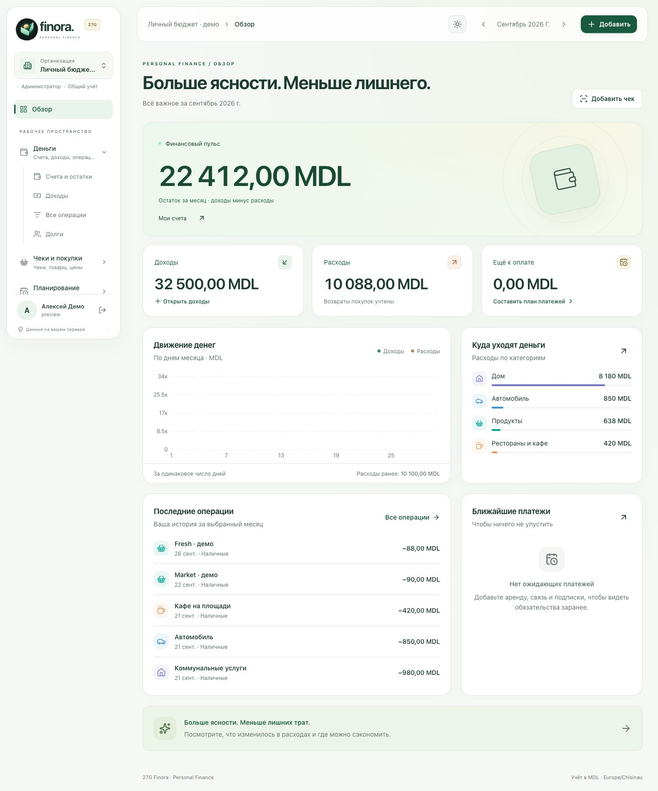
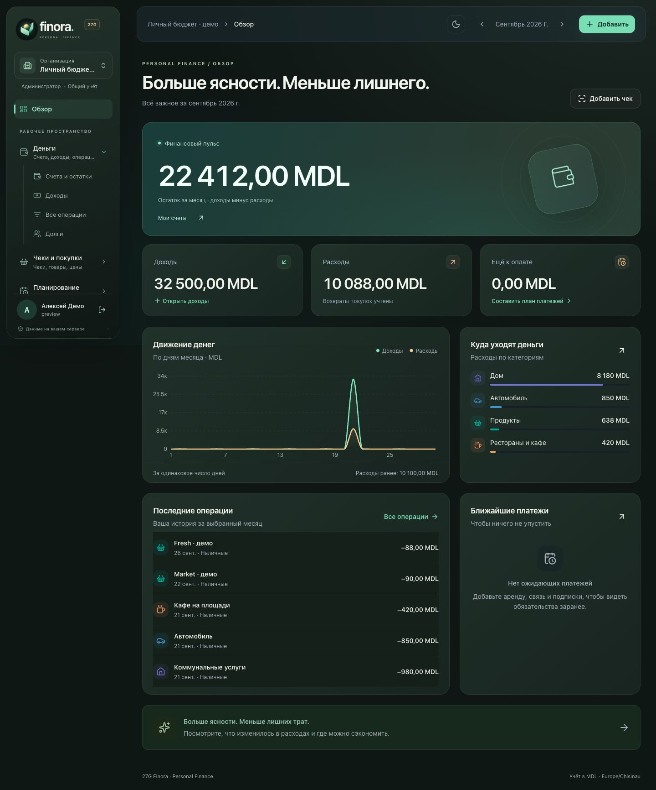
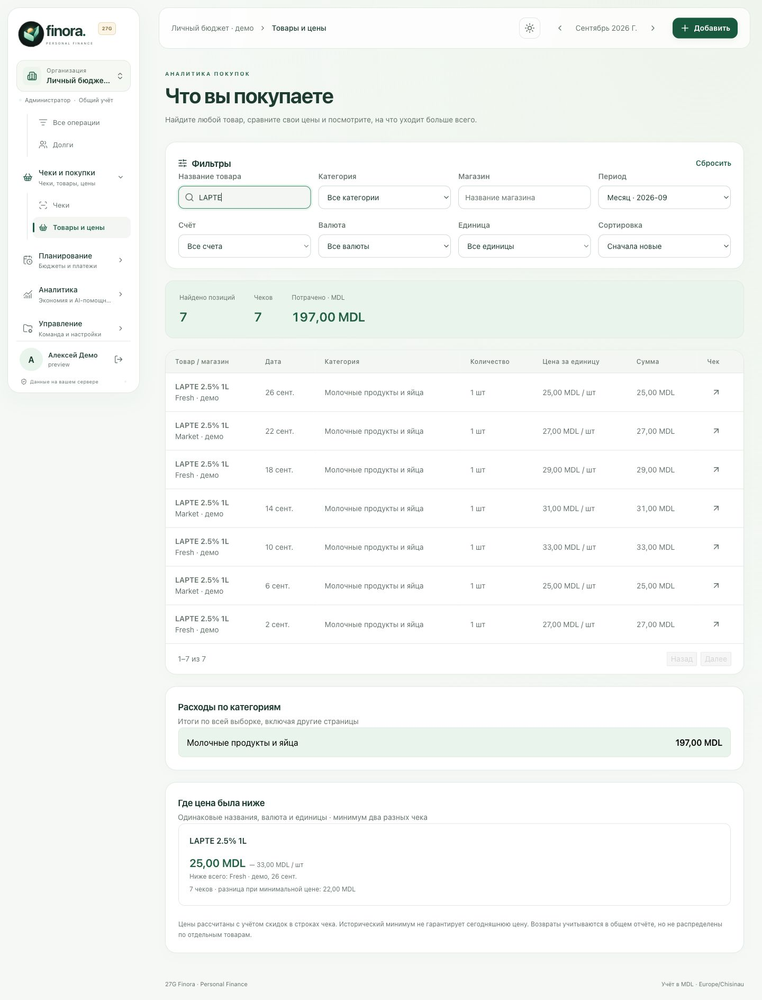
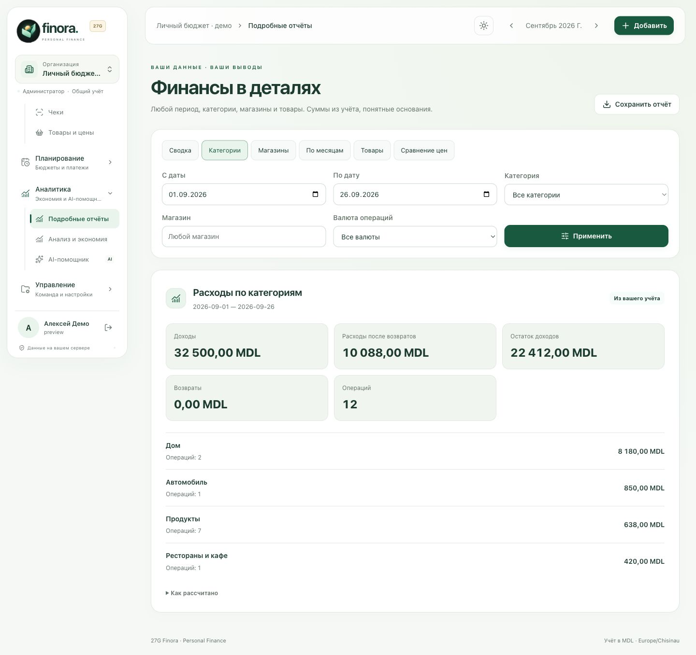
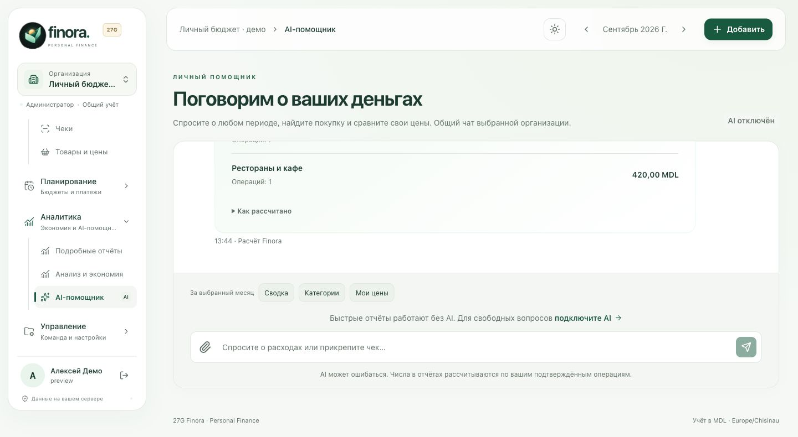
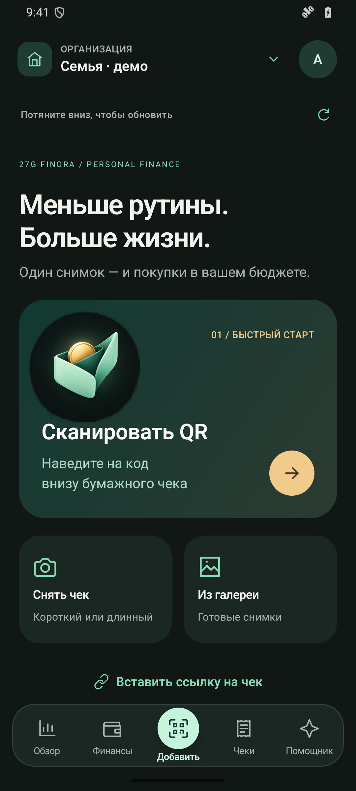
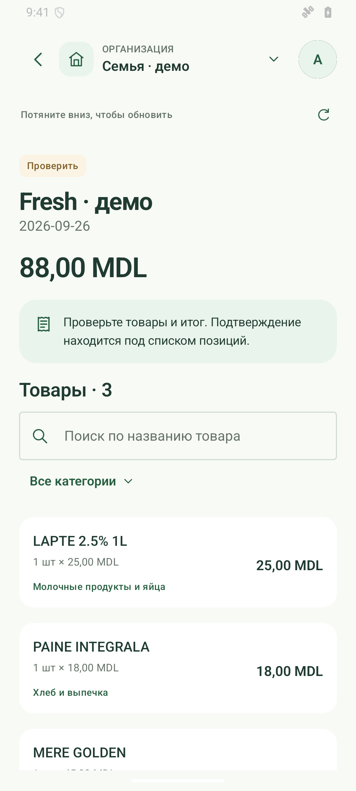
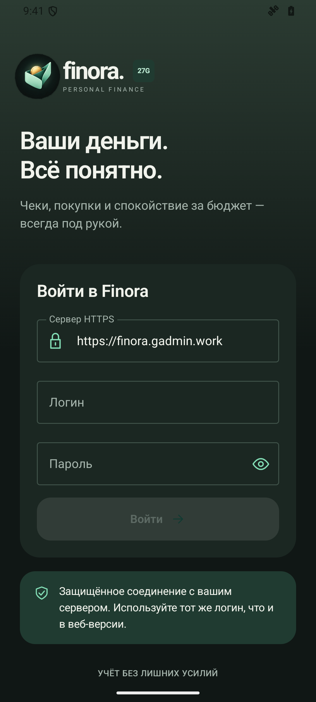
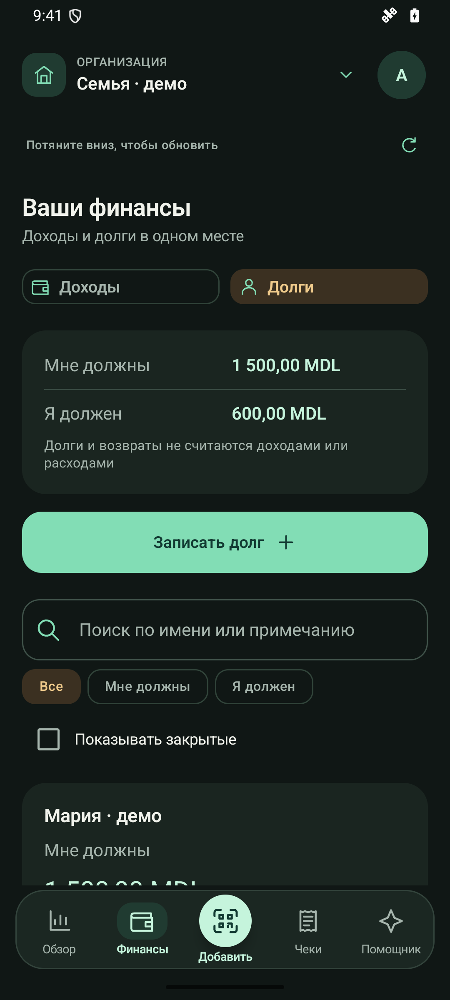

# A closer look at Finora

[← Back to Finora](../README.md) · [Get started](../README.md#get-started) · [Android](../android/README.md) · [Русская инструкция](../README.ru.md)

Actual web and native Android screens, captured in September 2026. All accounts, organizations, people, purchases and amounts below are **fictional demonstration data**. Select an image to view it at full resolution.

## One month, two ways to see it

The overview brings income, expenses, upcoming payments, category totals and recent activity together. Light and dark themes follow the device by default and can be changed manually.

<table>
<tr><th width="50%">Light</th><th width="50%">Dark</th></tr>
<tr><td></td><td></td></tr>
</table>

## Find the items behind the total

Search a product and compare what you paid across stores and dates. The example searches for **LAPTE** and shows its purchase history, category and historical price range. These are your own recorded prices, not live offers from shops.

## Understand the numbers

Choose a period and explore categories, merchants, months, products or price comparisons. Reports explain their calculation and can be exported.

The assistant puts these reports in a conversation. This example shows a **preset report with AI disabled** and seeded demonstration conversation text. Connecting an AI provider adds free-form questions and explanations; the backend still calculates the totals.

## Made for the phone in your hand

Capture a QR or photo, inspect the recognized receipt, follow the month and manage debts. These screenshots come from the real Android application running on an isolated emulator with synthetic state; they are not interface mockups.

<table>
<tr><th width="25%">Capture</th><th width="25%">Review</th><th width="25%">Overview</th><th width="25%">Debts</th></tr>
<tr>
<td></td>
<td></td>
<td></td>
<td></td>
</tr>
</table>

The central action adds a receipt; profile and appearance live under the avatar. Pull down to refresh. [Mobile finance guide](MOBILE-FINANCE.md) · [Long-receipt guide](LONG-RECEIPTS.md)

## Artwork and capture notes

- The cover combines the approved Finora origami-wallet logo with actual application screenshots. Its reproducible layout is in [cover.html](assets/showcase/cover.html); the exported image is 1280 × 640.
- Web screenshots use an isolated local database. Android screenshots use an offline fixture with no server session or AI credentials. The two examples show separate demo workspaces.
- Production receipts, profile photos, credentials, URLs containing receipt identifiers and private financial records are not included.
- Screens illustrate the September 2026 application. See the [current documentation](../README.md) for supported behavior and limitations.
