# A closer look at Finora · Finora в деталях

[English screenshots](#en) · [Скриншоты на русском](#ru) · [Language guide / Выбор языка](LANGUAGES.md)

[English README](../README.md) · [Русская инструкция](../README.ru.md) · [Android](../android/README.md)

## English

Explore the web and native Android interfaces in English. The gallery uses fictional demonstration records; names, receipts and other user-entered content keep their original language. Select an image to view it at full resolution.

### Start in your language

Choose English, Russian or the device language before signing in. Later, language and appearance settings stay within reach in your profile. The choice is saved separately on each browser or phone.

<table>
<tr><th width="50%">Before sign-in</th><th width="50%">In your profile</th></tr>
<tr><td></td><td></td></tr>
</table>

### One month, two ways to see it

Income, expenses, upcoming payments, category totals and recent activity, together. Follow the device theme or choose light or dark.

<table>
<tr><th width="50%">Light</th><th width="50%">Dark</th></tr>
<tr><td></td><td></td></tr>
</table>

### Find the items behind the total

Search a product and compare what you paid across stores and dates. These are historical prices from your own receipts, not live shop offers.

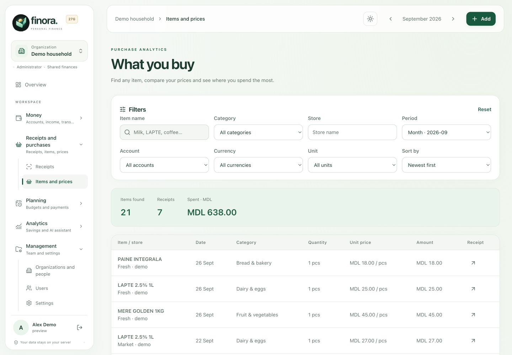

### Understand the numbers

Explore categories, stores, months, products and prices for the period you choose. Reports explain the calculation and can be exported.

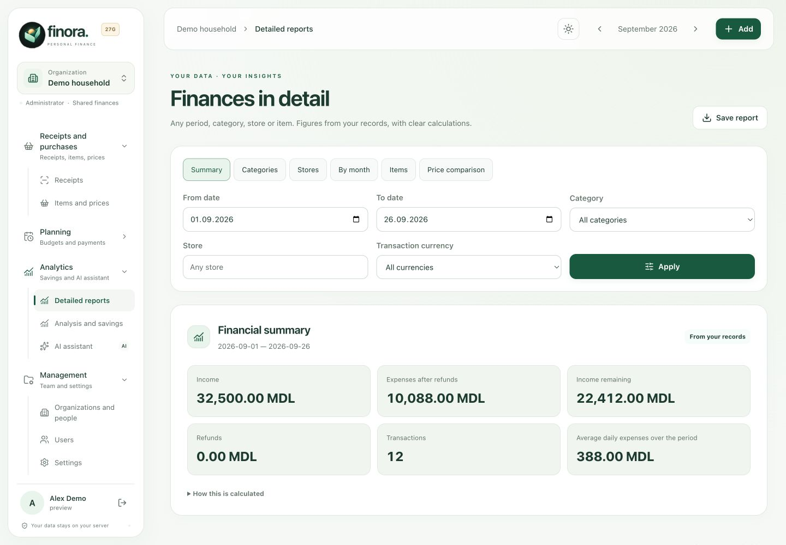

The assistant puts reports into a conversation. Preset reports work without AI. An optional provider adds free-form questions and explanations; Finora's backend still calculates the totals.

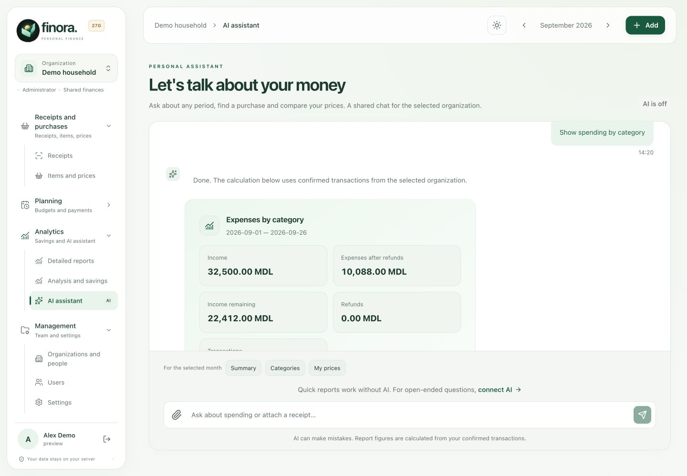

### On your phone

Capture a QR or photo, review a receipt, follow your month and manage debts. Open your profile through the avatar to change language or theme.

<table>
<tr><th width="25%">Capture</th><th width="25%">Review</th><th width="25%">Overview</th><th width="25%">Debts</th></tr>
<tr><td></td><td></td><td></td><td><a href="assets/showcase/en/android-debts.png">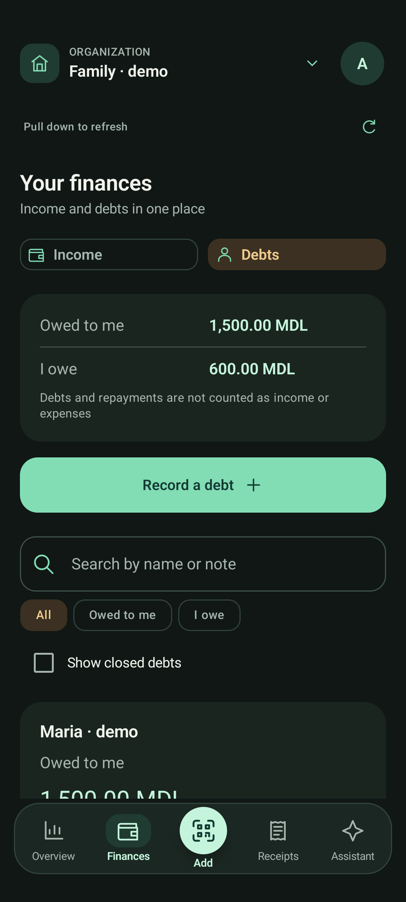</a></td></tr>
</table>

<table>
<tr><th width="50%">Sign-in language</th><th width="50%">Profile preferences</th></tr>
<tr><td><a href="assets/showcase/en/android-login.png">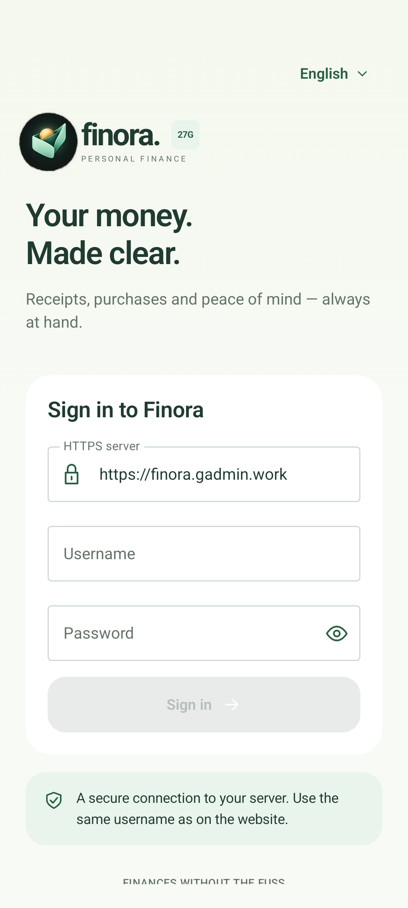</a></td><td><a href="assets/showcase/en/android-settings.png">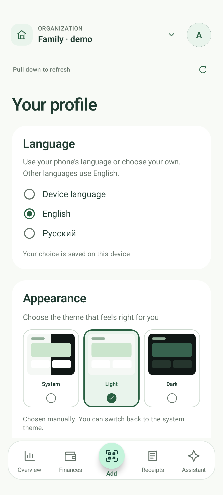</a></td></tr>
</table>

[View the same screens in Russian ↓](#ru) · [Mobile finance](MOBILE-FINANCE.md) · [Long receipts](LONG-RECEIPTS.md)

## Русский

Веб и нативный Android на русском. В галерее используются вымышленные демонстрационные записи; названия и содержимое чеков сохраняют исходный язык. Нажмите изображение, чтобы открыть его в полном размере.

### Ваш язык — до первого входа

На экране входа выберите русский, английский или язык устройства. После входа язык и оформление доступны в профиле. Выбор сохраняется отдельно в каждом браузере и телефоне.

<table>
<tr><th width="50%">До входа</th><th width="50%">В профиле</th></tr>
<tr><td></td><td></td></tr>
</table>

### Один месяц — две темы

Доходы, расходы, ближайшие платежи, категории и последние операции на одном экране. Можно следовать теме устройства или выбрать светлую либо тёмную вручную.

<table>
<tr><th width="50%">Светлая</th><th width="50%">Тёмная</th></tr>
<tr><td></td><td><a href="assets/showcase/ru/web-dark.jpg">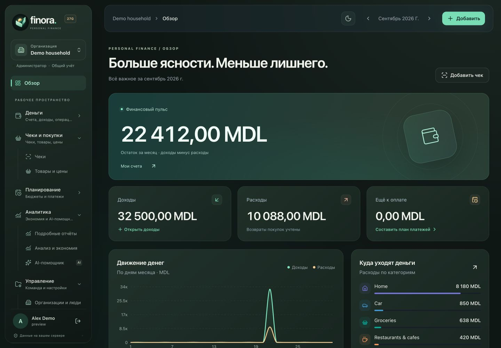</a></td></tr>
</table>

### Товары за общей суммой

Найдите покупку и сравните цены в своих чеках за разные даты и по разным магазинам. Это история ваших покупок, а не актуальные предложения магазинов.

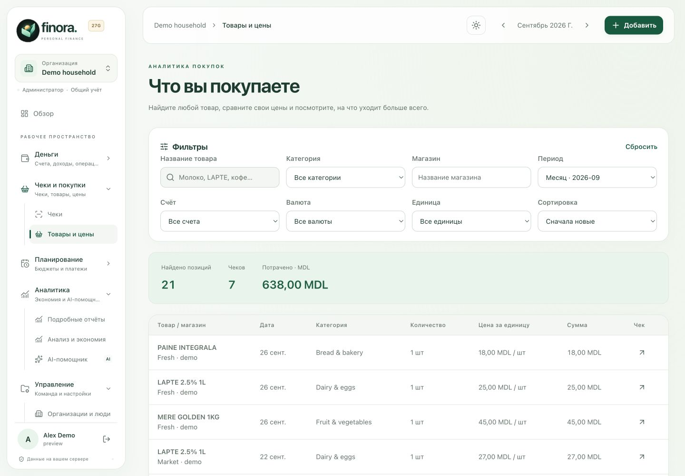

### Понятные расчёты

Выберите период, категории, магазины, товары или сравнение цен. Отчёты показывают основания расчёта и поддерживают экспорт.

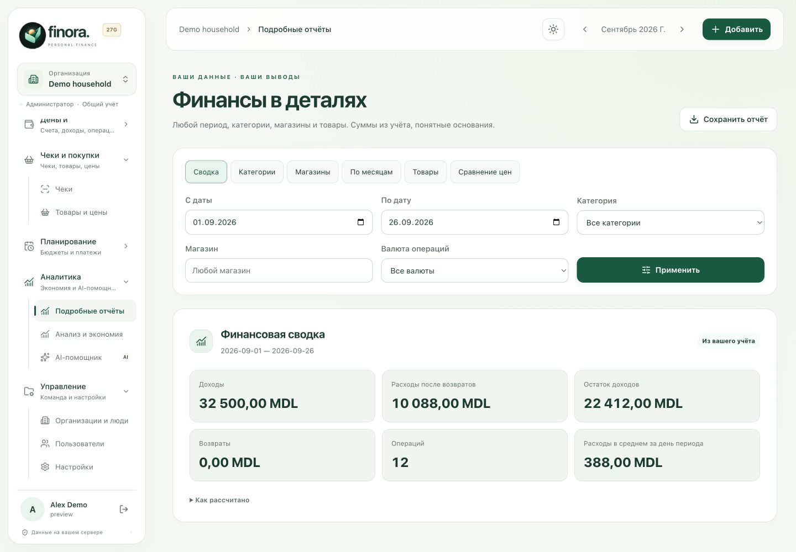

Помощник объединяет отчёты с диалогом. Готовые отчёты работают без AI. Подключённый провайдер добавляет свободные вопросы и пояснения, а суммы по-прежнему рассчитывает сервер Finora.

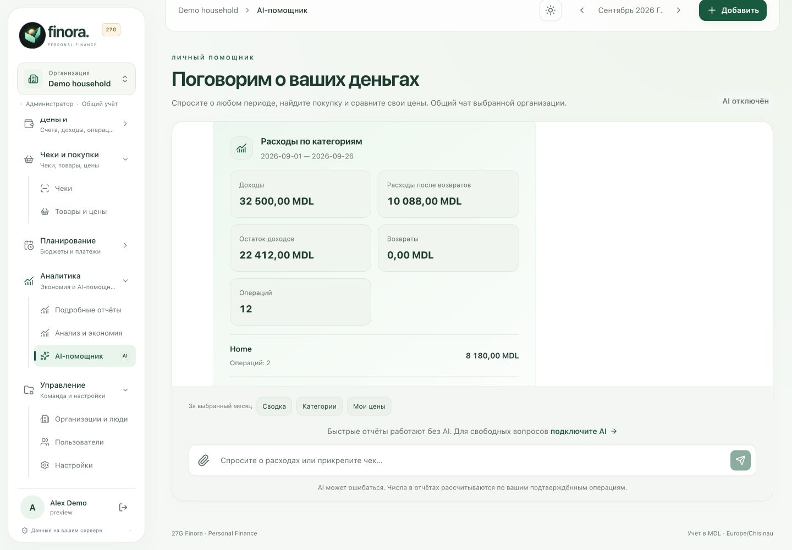

### На телефоне

Снимите QR или фото, проверьте чек, посмотрите итоги месяца и долги. Чтобы изменить язык или тему, откройте профиль через аватар.

<table>
<tr><th width="25%">Снять</th><th width="25%">Проверить</th><th width="25%">Разобраться</th><th width="25%">Долги</th></tr>
<tr><td></td><td></td><td></td><td><a href="assets/showcase/ru/android-debts.png">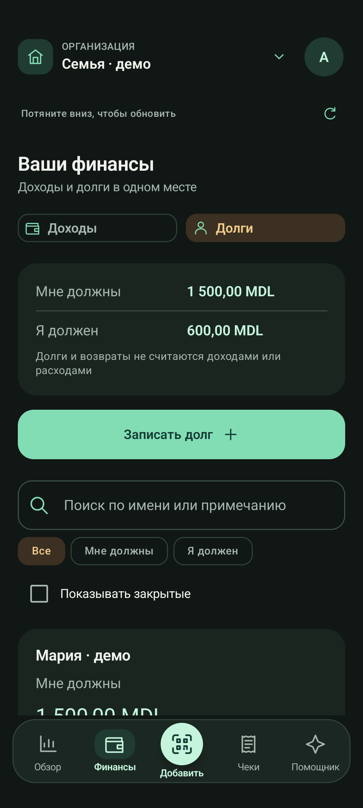</a></td></tr>
</table>

<table>
<tr><th width="50%">Язык при входе</th><th width="50%">Настройки профиля</th></tr>
<tr><td><a href="assets/showcase/ru/android-login.png">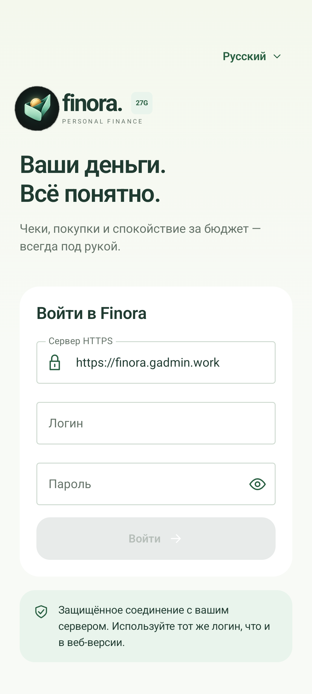</a></td><td><a href="assets/showcase/ru/android-settings.png">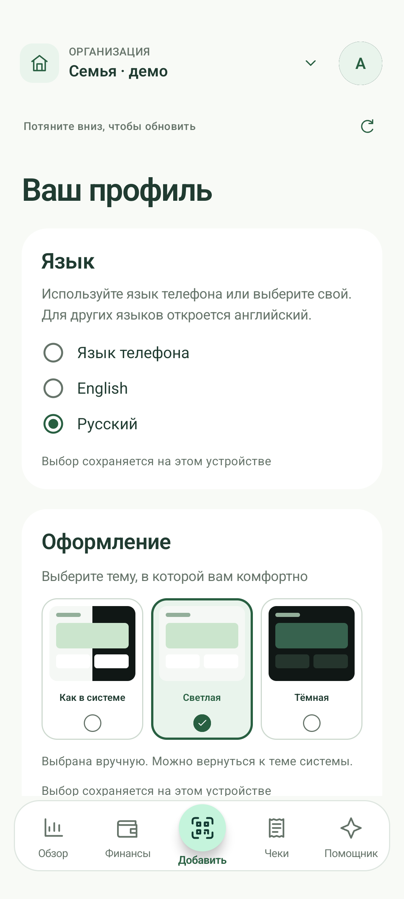</a></td></tr>
</table>

[Эти же экраны на английском ↑](#en) · [Доходы и долги на телефоне](MOBILE-FINANCE.md) · [Длинные чеки](LONG-RECEIPTS.md)

## Capture notes · О скриншотах

Keep screenshot fixtures isolated from production. Do not include real receipts, personal financial records, credentials, private profile photos or receipt URLs containing identifiers. Language selection changes the interface; it must not rewrite fixture data to imitate a translation.

Для обновления галереи используйте отдельные демонстрационные данные и реальные экраны приложения. Не включайте настоящие чеки, финансовые записи, пароли, личные фотографии и ссылки с идентификаторами чеков. Английские изображения хранятся в `assets/showcase/en/`, русские — в `assets/showcase/ru/`.
